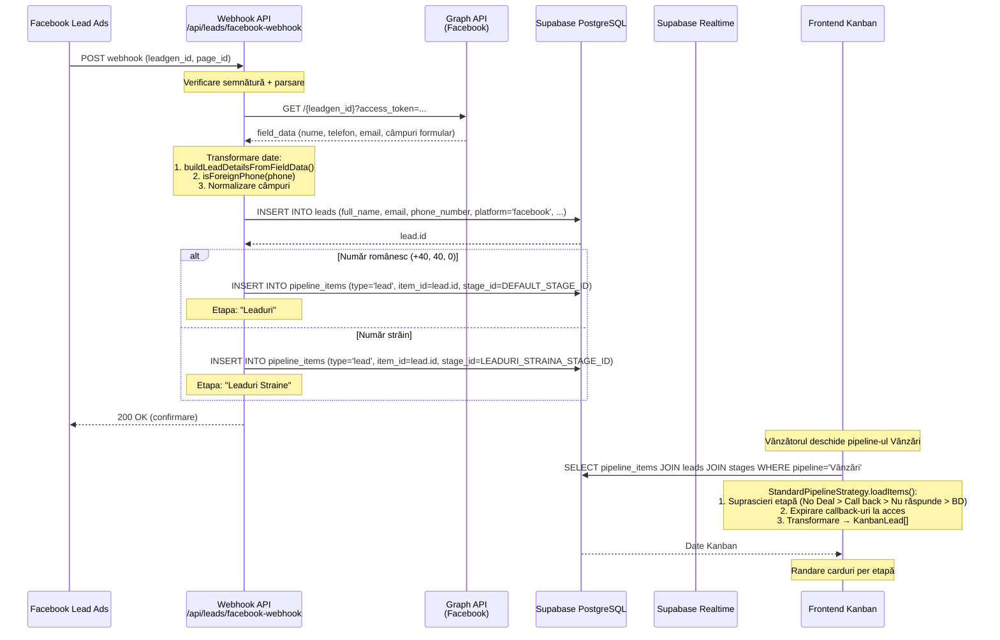
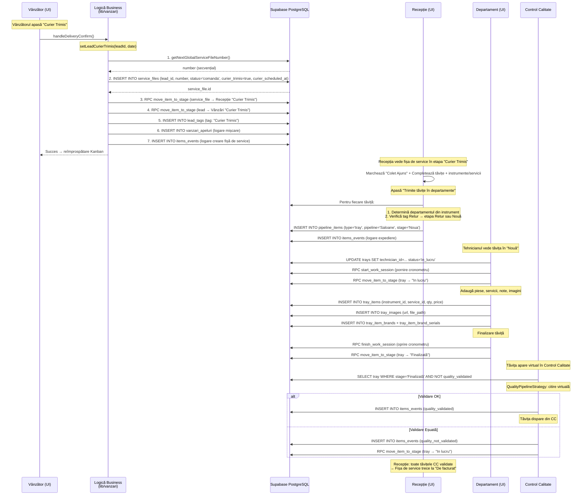
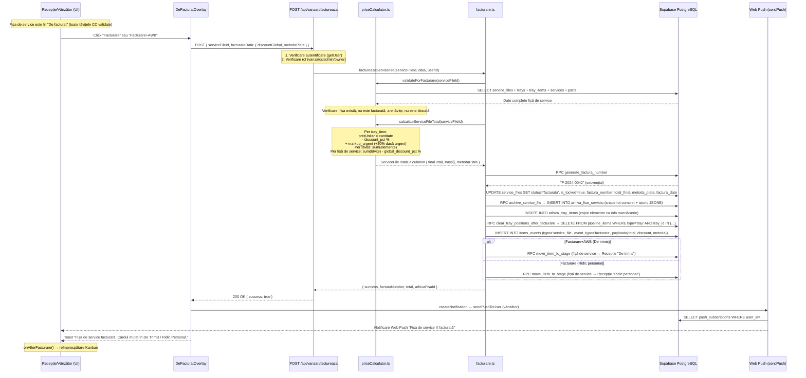
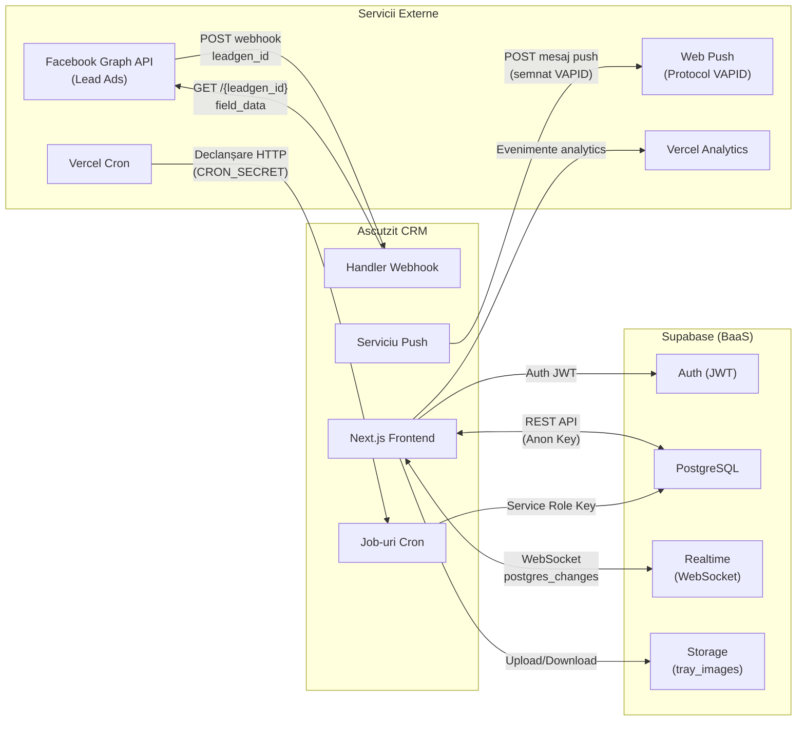

# Analiza Bazei de Date, Fluxuri de Date și Integrări

---

## 1. Schema Bazei de Date

### 1.1 Diagrama Entitate-Relație (Mermaid)

```mermaid
erDiagram
    %% ===== ENTITĂȚI PRINCIPALE =====

    auth_users {
        uuid id PK
        text email
        jsonb user_metadata
    }

    app_members {
        uuid user_id PK,FK
        text role "owner|admin|member|vanzator|receptie|tehnician"
        text name
        text technician_status "disponibil|ocupat"
        uuid current_tray_id FK
        text job_type
        boolean is_active
    }

    user_preferences {
        uuid id PK
        uuid user_id FK,UK
        jsonb preferences
    }

    user_pipeline_permissions {
        uuid id PK
        uuid user_id FK
        uuid pipeline_id FK
    }

    %% ===== SISTEM PIPELINE =====

    pipelines {
        uuid id PK
        varchar name UK
        text description
        integer position
        boolean is_active
        uuid created_by FK
    }

    stages {
        uuid id PK
        uuid pipeline_id FK
        varchar name
        integer position
        boolean is_active
        text color
        jsonb config
    }

    pipeline_items {
        uuid id PK
        text type "lead|service_file|tray"
        uuid item_id
        uuid pipeline_id FK
        uuid stage_id FK
        timestamp created_at
        timestamp updated_at
    }

    %% ===== LEAD-URI ȘI VÂNZĂRI =====

    leads {
        uuid id PK
        varchar full_name
        varchar email
        varchar phone_number
        varchar platform "facebook|manual"
        varchar campaign_name
        varchar form_name
        boolean call_back
        timestamp callback_date
        boolean nu_raspunde
        timestamp nu_raspunde_callback_at
        boolean no_deal
        timestamp no_deal_at
        text details
        text city
        text company_name
        text billing_cui
        uuid claimed_by FK
        uuid created_by FK
        uuid curier_trimis_user_id FK
        uuid office_direct_user_id FK
        timestamp curier_trimis_at
        timestamp office_direct_at
    }

    tags {
        uuid id PK
        text name UK
        text color "green|yellow|red|orange|blue"
    }

    lead_tags {
        uuid lead_id PK,FK
        uuid tag_id PK,FK
    }

    vanzari_apeluri {
        uuid id PK
        uuid lead_id FK
        uuid pipeline_id FK
        uuid from_stage_id FK
        uuid to_stage_id FK
        uuid moved_by FK
        timestamp apel_at
    }

    %% ===== FIȘE DE SERVICE =====

    service_files {
        uuid id PK
        uuid lead_id FK
        text number
        date date
        text status "noua|in_lucru|finalizata|comanda|facturata"
        boolean office_direct
        boolean curier_trimis
        boolean colet_neridicat
        boolean colet_ajuns
        boolean retur
        boolean urgent
        boolean no_deal
        boolean cash
        boolean card
        numeric global_discount_pct
        boolean is_locked
        timestamp curier_scheduled_at
        timestamp archived_at
        text subscription_type
        jsonb technician_details
    }

    %% ===== TĂVIȚE =====

    trays {
        uuid id PK
        text number
        uuid service_file_id FK
        text status "in_receptie|in_lucru|gata"
        text availability_status "disponibil|indisponibil|assigned|finished"
        uuid technician_id FK
        uuid technician2_id FK
        uuid technician3_id FK
        uuid parent_tray_id FK
        integer priority
        text qc_notes
    }

    tray_items {
        uuid id PK
        uuid tray_id FK
        uuid department_id FK
        uuid instrument_id FK
        uuid service_id FK
        uuid part_id FK
        uuid technician_id FK
        uuid technician2_id FK
        uuid technician3_id FK
        integer qty
        real discount
        integer unrepaired_qty
        boolean guaranty
        text serials
    }

    tray_images {
        uuid id PK
        uuid tray_id FK
        text url
        text file_path
        text filename
    }

    tray_item_brands {
        uuid id PK
        uuid tray_item_id FK
        text brand
        boolean garantie
    }

    tray_item_brand_serials {
        uuid id PK
        uuid brand_id FK
        text serial_number
    }

    %% ===== CATALOG =====

    departments {
        uuid id PK
        text name "reparatii|ascutire"
    }

    instruments {
        uuid id PK
        text name
        uuid department_id FK
        uuid pipeline FK
        boolean active
        uuid created_by FK
    }

    services {
        uuid id PK
        text name
        numeric price
        integer time
        uuid instrument_id FK
        uuid department_id FK
        boolean active
        uuid created_by FK
    }

    parts {
        uuid id PK
        text name
        numeric price
        text model
        boolean active
        uuid created_by FK
    }

    %% ===== COMUNICARE =====

    conversations {
        uuid id PK
        text type "direct|lead|service_file|general"
        uuid related_id
        uuid created_by FK
        timestamp last_message_at
    }

    messages {
        uuid id PK
        uuid conversation_id FK
        uuid sender_id FK
        text content
        text message_type "text|file|system|image"
        uuid image_id FK
        boolean has_attachments
    }

    notifications {
        uuid id PK
        uuid user_id FK
        text type
        text title
        text message
        jsonb data
        boolean read
        timestamp read_at
    }

    push_subscriptions {
        uuid id PK
        uuid user_id FK
        text endpoint UK
        text p256dh
        text auth
    }

    %% ===== ISTORIC ȘI AUDIT =====

    items_events {
        uuid id PK
        text type "lead|service_file|tray"
        uuid item_id
        text event_type
        text message
        jsonb payload
        uuid actor_id FK
        text actor_name
    }

    stage_history {
        uuid id PK
        uuid lead_id FK
        uuid tray_id FK
        uuid service_file_id FK
        uuid pipeline_id FK
        uuid from_stage_id FK
        uuid to_stage_id FK
        uuid moved_by FK
        timestamp moved_at
    }

    audit_log {
        uuid id PK
        text table_name
        uuid record_id
        text operation
        jsonb old_data
        jsonb new_data
        uuid actor_id FK
    }

    %% ===== SESIUNI DE LUCRU =====

    technician_work_sessions {
        uuid id PK
        uuid tray_id FK
        uuid technician_id FK
        timestamp started_at
        timestamp finished_at
    }

    %% ===== ARHIVĂ =====

    arhiva_fise_serviciu {
        uuid id PK
        uuid lead_id FK
        text number
        text status
        jsonb istoric
        jsonb technician_details
        timestamp archived_at
    }

    arhiva_tray_items {
        uuid id PK
        uuid arhiva_fisa_id FK
        uuid department_id FK
        uuid instrument_id FK
        uuid service_id FK
        uuid part_id FK
        uuid technician_id FK
        numeric qty
        text info
    }

    seller_statistics {
        uuid id PK
        uuid user_id FK
        text metric_name
        numeric metric_value
    }

    %% ===== RELAȚII =====

    auth_users ||--o| app_members : "1:1 profil"
    auth_users ||--o| user_preferences : "1:1 preferințe"
    auth_users ||--o{ user_pipeline_permissions : "1:N permisiuni"
    auth_users ||--o{ push_subscriptions : "1:N abonări"
    auth_users ||--o{ notifications : "1:N notificări"

    pipelines ||--|{ stages : "1:N etape"
    pipelines ||--o{ pipeline_items : "1:N elemente"
    pipelines ||--o{ user_pipeline_permissions : "1:N permisiuni"

    stages ||--o{ pipeline_items : "1:N elemente"

    leads ||--o{ service_files : "1:N fișe de service"
    leads ||--o{ lead_tags : "M:N tag-uri"
    leads ||--o{ vanzari_apeluri : "1:N apeluri"
    leads ||--o{ stage_history : "1:N istoric"
    leads ||--o| arhiva_fise_serviciu : "1:N arhivă"

    tags ||--o{ lead_tags : "M:N lead-uri"

    service_files ||--|{ trays : "1:N tăvițe"
    service_files ||--o{ stage_history : "1:N istoric"

    trays ||--|{ tray_items : "1:N elemente"
    trays ||--o{ tray_images : "1:N imagini"
    trays ||--o{ technician_work_sessions : "1:N sesiuni"
    trays ||--o{ stage_history : "1:N istoric"
    trays ||--o| trays : "auto-ref părinte (split)"

    tray_items ||--o{ tray_item_brands : "1:N mărci"
    tray_item_brands ||--o{ tray_item_brand_serials : "1:N numere de serie"

    departments ||--o{ instruments : "1:N instrumente"
    departments ||--o{ services : "1:N servicii"

    instruments ||--|{ services : "1:N servicii"
    instruments ||--o{ tray_items : "1:N referințe"

    app_members ||--o{ trays : "1:N (technician_id)"

    conversations ||--|{ messages : "1:N mesaje"

    arhiva_fise_serviciu ||--|{ arhiva_tray_items : "1:N elemente arhivă"
```

### 1.2 Clasificare Entități și Cardinalitate

#### Business Principal (Flux Principal)

| Entitate | PK | Relații Cheie | Descriere |
| :--- | :--- | :--- | :--- |
| **leads** | `id` (uuid) | → `service_files` (1:N), → `lead_tags` (M:N), → `vanzari_apeluri` (1:N) | Client/cerere – entitatea centrală |
| **service_files** | `id` (uuid) | → `leads.id` (FK), → `trays` (1:N) | Fișă de service – creată la confirmarea livrării |
| **trays** | `id` (uuid) | → `service_files.id` (FK), → `tray_items` (1:N), → self (`parent_tray_id`) | Tăviță cu instrumente – container fizic |
| **tray_items** | `id` (uuid) | → `trays.id`, → `instruments.id`, → `services.id`, → `parts.id`, → `departments.id` | Element linie: instrument + serviciu + piesă |

#### Sistem Pipeline Kanban

| Entitate | PK | Relații Cheie | Descriere |
| :--- | :--- | :--- | :--- |
| **pipelines** | `id` (uuid) | → `stages` (1:N) | Pipeline: Vânzări, Recepție, Saloane, Horeca, Frizerii, Reparații, Calitate |
| **stages** | `id` (uuid) | → `pipelines.id` (FK) | Etapă în pipeline (ex.: Leaduri, No Deal, În lucru) |
| **pipeline_items** | `id` (uuid) | → `pipelines.id`, → `stages.id` | Poziția elementului (lead/fișă de service/tăviță) în pipeline + etapă |

#### Catalog

| Entitate | PK | Relații Cheie | Descriere |
| :--- | :--- | :--- | :--- |
| **departments** | `id` (uuid) | → `instruments` (1:N), → `services` (1:N) | Departament: reparații, ascuțire |
| **instruments** | `id` (uuid) | → `departments.id`, → `pipelines.id`, → `services` (1:N) | Instrument din catalog (ex.: Forfecuță cuticule) |
| **services** | `id` (uuid) | → `instruments.id`, → `departments.id` | Serviciu per instrument (ex.: Ascuțire) |
| **parts** | `id` (uuid) | - | Piesă de schimb |
| **tray_item_brands** | `id` (uuid) | → `tray_items.id` | Marcă per element (ex.: Jaguar) |
| **tray_item_brand_serials** | `id` (uuid) | → `tray_item_brands.id` | Numere de serie per marcă |

#### Utilizatori și Permisiuni

| Entitate | PK | Relații Cheie | Descriere |
| :--- | :--- | :--- | :--- |
| **auth.users** | `id` (uuid) | Supabase Auth integrat | Cont de autentificare |
| **app_members** | `user_id` (uuid, FK) | 1:1 cu `auth.users` | Profil aplicație (rol, status, job) |
| **user_pipeline_permissions** | `id` (uuid) | → `auth.users.id`, → `pipelines.id` | Permisiune acces pipeline |
| **user_preferences** | `id` (uuid) | → `auth.users.id` (UK) | Preferințe utilizator (JSON) |

#### Comunicare și Notificări

| Entitate | PK | Relații Cheie | Descriere |
| :--- | :--- | :--- | :--- |
| **conversations** | `id` (uuid) | → `messages` (1:N), `related_id` → lead/fișă de service | Conversație: lead, service_file, direct, general |
| **messages** | `id` (uuid) | → `conversations.id`, → `auth.users` (expeditor) | Mesaj: text, imagine, fișier, sistem |
| **notifications** | `id` (uuid) | → `auth.users.id` | Notificare in-app |
| **push_subscriptions** | `id` (uuid) | → `auth.users.id` | Abonare Web Push (VAPID) |

#### Audit și Istoric

| Entitate | PK | Relații Cheie | Descriere |
| :--- | :--- | :--- | :--- |
| **items_events** | `id` (uuid) | `item_id` → lead/fișă de service/tăviță (polimorfic) | Jurnal evenimente per element |
| **stage_history** | `id` (uuid) | → lead/tăviță/fișă de service, → pipeline, → etape | Istoric mișcări etape |
| **audit_log** | `id` (uuid) | - | Audit general (tabel, înregistrare, operațiune) |
| **vanzari_apeluri** | `id` (uuid) | → `leads.id`, → etape | Jurnal mișcări în pipeline-ul Vânzări |
| **technician_work_sessions** | `id` (uuid) | → `trays.id` | Sesiuni de lucru tehnicieni |
| **seller_statistics** | `id` (uuid) | → `auth.users.id` | Statistici agregate vânzători |

#### Arhivă

| Entitate | PK | Relații Cheie | Descriere |
| :--- | :--- | :--- | :--- |
| **arhiva_fise_serviciu** | `id` (uuid) | → `leads.id` | Snapshot fișă de service la momentul facturării |
| **arhiva_tray_items** | `id` (uuid) | → `arhiva_fise_serviciu.id` | Snapshot elemente tăvițe la arhivare |

### 1.3 Câmpuri Critice și Indecși Impliciți

- **Toate PK-urile** sunt `uuid` generate cu `gen_random_uuid()`.
- **Chei Externe** cu CASCADE implicit prin Supabase.
- **Constrângeri unice**: `leads.lead_id`, `pipelines.name`, `tags.name`, `push_subscriptions.endpoint`, `user_preferences.user_id`.
- **Constrângeri check**: `app_members.technician_status`, `departments.name`, `conversations.type`, `messages.message_type`, `tags.color`, `trays.availability_status`.
- **Referințe polimorfice**: `pipeline_items.type` + `item_id` (lead/service_file/tray), `items_events.type` + `item_id`.
- **Auto-referențial**: `trays.parent_tray_id` → `trays.id` (pentru tăvițe împărțite).

---

## 2. Fluxuri de Date (3 Funcționalități Principale)

### 2.1 Flux 1: Captare Lead din Facebook → Afișare în Kanban Vânzări

**Transformări de date:**
1. **Facebook → CRM**: `field_data` (array `{name, values}`) → câmpuri lead (`full_name`, `phone_number`, `email`, `details`).
2. **Normalizare telefon**: `isForeignPhone()` → clasificare lead în Leaduri vs Leaduri Straine.
3. **BD → UI**: `pipeline_items` + `leads` → `KanbanLead` (join + suprascriere etapă + îmbogățire tag-uri).

---

### 2.2 Flux 2: Confirmare Livrare → Creare Fișă de Service → Trimitere Tăvițe → Finalizare

**Transformări de date:**
1. **UI → BD**: Date formular livrare → rând `service_files` + `pipeline_items` + `lead_tags` + `vanzari_apeluri`.
2. **Expediere tăvițe**: Instrumente → determinare departament (Saloane/Horeca/Frizerii/Reparații) → `pipeline_items` per tăviță.
3. **Control Calitate**: Citire virtuală din `pipeline_items` departamente (etapa Finalizată) + filtrare `items_events` → afișare fără rânduri proprii în `pipeline_items`.

---

### 2.3 Flux 3: Facturare → Arhivare → Notificare

**Transformări de date:**
1. **UI → API**: `{ serviceFileId, facturareData }` → validare Zod implicită.
2. **Calcul prețuri**: `tray_items` (qty, price, discount) → `ItemTotalCalculation` → `TrayTotalCalculation` → `ServiceFileTotalCalculation` cu markup urgent +30%.
3. **Arhivare**: `service_files` + `trays` + `tray_items` + `stage_history` + `items_events` + `messages` → snapshot JSONB complet în `arhiva_fise_serviciu.istoric`.
4. **Notificare**: `createNotification` → inserare `notifications` + `sendPushToUser` (web-push VAPID la toate abonările utilizatorului).

---

## 3. Endpoint-uri API și Integrări Externe

### 3.1 Endpoint-uri Interne (48 handler-e de rute)

#### Lead-uri și Vânzări

| Metodă | Endpoint | Permisiuni | Descriere |
| :--- | :--- | :--- | :--- |
| GET/POST | `/api/leads/facebook-webhook` | Public (token verificare) | Webhook Facebook Lead Ads + verificare abonare |
| POST | `/api/leads/simulate-facebook` | Dev/Secret | Simulare lead Facebook (testare) |
| POST | `/api/leads/expire-callbacks` | Autentificat | Expirare callback/nu_răspunde (la acces) |
| POST | `/api/leads/move-to-colet-neridicat` | Autentificat | Mutare fișe de service în Colet Neridicat |
| POST | `/api/leads/move-with-service-files` | Autentificat | Mutare lead + fișe de service între etape |
| GET | `/api/vanzari/add-suna-tag` | Admin (CRON_SECRET) | Adăugare tag "Sună!" pe lead-urile expirate |
| POST | `/api/vanzari/factureaza` | Vânzător/Admin/Proprietar | Facturare completă fișă de service |
| POST | `/api/vanzari/anuleaza-factura` | Admin/Proprietar | Anulare factură (motiv obligatoriu) |
| GET | `/api/vanzari/statistics` | Vânzător/Admin/Proprietar | Statistici avansate vânzări |

#### Fișe de Service și Tăvițe

| Metodă | Endpoint | Permisiuni | Descriere |
| :--- | :--- | :--- | :--- |
| POST | `/api/service-files/set-colet-ajuns` | Service Role | Marcare fișă de service ca "colet ajuns" |
| POST | `/api/service-files/archive-and-release` | Admin/Proprietar | Arhivare + eliberare tăvițe (atomic) |
| GET | `/api/trays/check-department-status` | Autentificat | Verificare status tăviță în departamente |

#### Job-uri Cron

| Metodă | Endpoint | Frecvență | Descriere |
| :--- | :--- | :--- | :--- |
| GET | `/api/cron/midnight-ro` | Zilnic 22:00 UTC | No Deal → Arhivat (24h) |
| GET | `/api/cron/curier-to-avem-comanda` | Zilnic 01:00 UTC | Curier/Office → Avem Comandă (24h) |
| POST | `/api/cron/vanzari-colet-neridicat` | Zilnic 23:59 | Colet Neridicat automat (2 zile) |
| POST | `/api/cron/vanzari-archive-no-deal` | Săptămânal | Arhivare No Deal > 30 zile |
| POST | `/api/cron/vanzari-followup-reminder` | Zilnic 09:00 | Reminder follow-up callback |
| POST | `/api/cron/backup` | Orar/Zilnic | Backup automat BD |

#### Căutare

| Metodă | Endpoint | Descriere |
| :--- | :--- | :--- |
| GET | `/api/search/unified?q=...` | Căutare unificată: lead-uri + fișe de service + tăvițe (RPC `search_unified`) |
| GET | `/api/search/trays?q=...` | Căutare tăvițe: număr, serie, marcă |

#### Notificări Push

| Metodă | Endpoint | Descriere |
| :--- | :--- | :--- |
| POST | `/api/push/subscribe` | Salvare abonare Web Push (upsert endpoint) |
| POST | `/api/push/test` | Test notificare push |
| GET | `/api/push/vapid-public` | Cheie publică VAPID |
| GET | `/api/push/status` | Status configurare push |
| GET | `/api/push/config-check` | Verificare completă VAPID |

#### Admin și Proprietar

| Metodă | Endpoint | Descriere |
| :--- | :--- | :--- |
| POST | `/api/admin/members/add` | Creare cont utilizator |
| POST | `/api/admin/members/reset-password` | Resetare parolă |
| GET | `/api/admin/members` | Lista membrilor |
| POST | `/api/admin/sync-users` | Sincronizare user_id cu auth.users |
| POST | `/api/admin/sync-all-members` | Sincronizare completă membri |
| POST | `/api/admin/backup` | Backup manual |
| GET | `/api/admin/download-backup` | Descărcare backup |
| DELETE | `/api/admin/delete-empty-trays` | Curățare tăvițe goale |
| POST | `/api/admin/backfill-service-file-status` | Completare retroactivă statusuri fișe de service |

#### Alte Rute

| Metodă | Endpoint | Descriere |
| :--- | :--- | :--- |
| GET | `/api/pipelines` | Lista pipeline-urilor |
| GET | `/api/stages` | Lista etapelor |
| POST | `/api/notifications/create` | Creare notificare (service role) |
| POST | `/api/tracking` | Urmărire evenimente (click, input_change) |
| POST | `/api/profile/update-display-name` | Actualizare nume afișat |
| POST | `/api/auth/username-to-email` | Conversie username → email (autentificare) |
| PATCH | `/api/work-sessions/[id]` | Editare sesiune de lucru (doar proprietar) |
| GET | `/api/technician-stats` | Statistici tehnicieni |
| GET | `/api/owner/db/tables` | Lista tabele BD (proprietar) |
| GET | `/api/owner/db/table/[tableName]` | Navigare tabel BD (proprietar) |
| POST | `/api/owner/backfill-vanzari-apeluri` | Completare retroactivă apeluri vânzări |
| POST | `/api/owner/atribuie-apel-manual` | Atribuire manuală apel |
| POST | `/api/owner/correct-curier-trimis-dates` | Corectare date curier |
| POST | `/api/setup/permissions` | Configurare inițială permisiuni |

### 3.2 Integrări Externe

#### Facebook Graph API

| Direcție | Date | Detalii |
| :--- | :--- | :--- |
| **Primire** (webhook) | `leadgen_id`, `page_id`, `form_id` | Facebook trimite POST pentru fiecare lead nou |
| **Trimitere** (fetch lead) | Request: `GET /{leadgen_id}?fields=...&access_token=PAGE_ACCESS_TOKEN` | CRM-ul apelează Graph API pentru date complete |
| **Primire** (răspuns) | `field_data[]` (nume, telefon, email, câmpuri personalizate), `custom_disclaimer_responses[]` | Datele sunt parsate și inserate în `leads` |
| **Var. mediu** | `FACEBOOK_PAGE_ACCESS_TOKEN`, `FACEBOOK_VERIFY_TOKEN` | Autentificare webhook și Graph API |

#### Web Push (Protocol VAPID)

| Direcție | Date | Detalii |
| :--- | :--- | :--- |
| **Browser → CRM** | `PushSubscription { endpoint, keys: { p256dh, auth } }` | Salvat în `push_subscriptions` |
| **CRM → Serviciu Push** | `{ title, body, url, tag, icon }` semnat cu `VAPID_PRIVATE_KEY` | Trimis prin biblioteca `web-push` |
| **Serviciu Push → Browser** | Notificare nativă (popup/banner) | Afișată automat de browser |
| **Var. mediu** | `NEXT_PUBLIC_VAPID_PUBLIC_KEY`, `VAPID_PRIVATE_KEY` | Chei VAPID generate cu `npx web-push generate-vapid-keys` |

#### Supabase

| Serviciu | Utilizare | Detalii |
| :--- | :--- | :--- |
| **Auth** | Token-uri JWT, gestionare sesiuni, resetare parolă | Reîmprospătare cookie prin middleware; 6 roluri personalizate |
| **PostgreSQL** | Toate datele de business (26+ tabele) | Acces: Anon Key (client, RLS) + Service Role Key (server, ocolire RLS) |
| **Realtime** | Abonări WebSocket pe `items_events`, `tags`, notificări | `postgres_changes` → evenimente INSERT/UPDATE |
| **Storage** | Bucket `tray_images` | Upload/download imagini tăvițe |
| **RPC** | 21+ funcții PostgreSQL | `move_item_to_stage`, `generate_factura_number`, `search_unified`, etc. |

#### Vercel

| Serviciu | Utilizare | Detalii |
| :--- | :--- | :--- |
| **Hosting** | Next.js SSR + Edge | App Router, funcții serverless |
| **Cron** | 2 job-uri cron în `vercel.json` (midnight-ro, curier-to-avem-comanda) | + 4 job-uri cron manuale/personalizate |
| **Analytics** | `@vercel/analytics` | Vizualizări pagini, web vitals |

### 3.3 Funcții RPC PostgreSQL (21 funcții server-side)

| RPC | Input → Output | Descriere |
| :--- | :--- | :--- |
| `move_item_to_stage` | `(type, item_id, pipeline_id, new_stage_id)` → succes | Mutare atomică + logare stage_history |
| `generate_factura_number` | `()` → text | Număr factură secvențial (F-YYYY-NNNN) |
| `archive_service_file` | `(service_file_id)` → arhiva_id | Snapshot complet în arhivă |
| `clear_tray_positions_after_facturare` | `(tray_ids[])` → void | Eliminare tăvițe din pipeline_items |
| `release_trays_on_archive` | `(tray_ids[], service_file_id)` → void | Eliberare tăvițe la arhivare |
| `start_work_session` | `(tray_id, tech_id)` → session_id | Pornire cronometru (idempotent) |
| `finish_work_session` | `(tray_id, tech_id)` → void | Oprire cronometru |
| `get_technician_work_minutes` | `(tech_id, start, end)` → minutes | Minute lucrate în interval |
| `get_technician_dashboard_bulk` | `(tech_ids[])` → bulk_data | Date dashboard tehnicieni (1 apel) |
| `get_expired_callback_leads` | `()` → lead_ids[] | Lead-uri cu callback expirat |
| `get_expired_nu_raspunde_leads` | `()` → lead_ids[] | Lead-uri cu nu_răspunde expirat |
| `get_user_pipeline_permissions` | `(user_id)` → pipeline_ids[] | Permisiuni pipeline |
| `get_pipeline_options` | `()` → pipelines[] | Opțiuni pipeline disponibile |
| `get_dashboard_stats` | `()` → stats | Statistici agregate dashboard |
| `get_vanzari_apeluri_counts_by_month` | `(months)` → counts[] | Numărări apeluri pe lună |
| `search_unified` | `(query)` → results[] | Căutare unificată (lead/fișă de service/tăviță) |
| `split_tray_to_real_trays` | `(tray_id, tech_assignments)` → new_tray_ids[] | Împărțire tăviță între tehnicieni |
| `merge_split_trays_if_all_finalized` | `(parent_tray_id)` → merged | Unificare tăvițe finalizate împărțite |
| `consolidate_tray_items` | `(tray_id)` → void | Consolidare elemente duplicate |
| `increment_seller_statistic` | `(user_id, metric, value)` → void | Incrementare statistică vânzător |
| `update_pipeline_and_reorder_stages` | `(pipeline_id, stages[])` → void | Actualizare + reordonare etape |

---

*Raport generat pe baza schemei SQL din `docs/sql data base.md`, tipurilor TypeScript din `lib/types/` și analizei codului sursă.*
