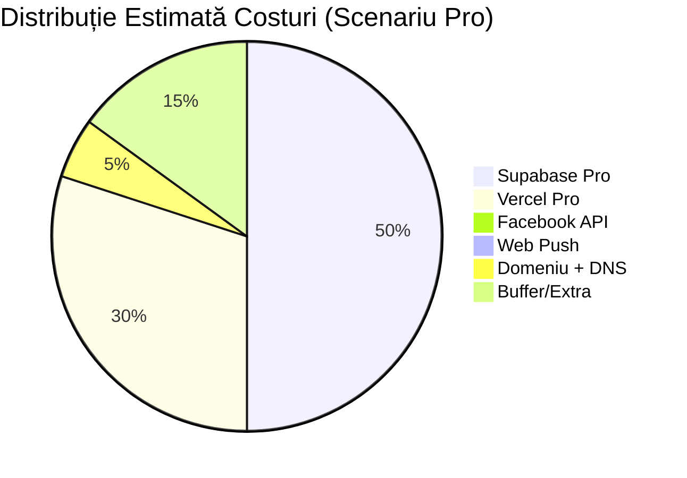

# Infrastructură, Scalabilitate & Estimare Costuri – Ascutzit CRM

---

## 1. Resurse Cloud Identificate

### 1.1 Servicii Utilizate

Proiectul folosește o arhitectură **serverless BaaS** (Backend-as-a-Service), fără infrastructură auto-găzduită:

| Serviciu | Furnizor | Rol | Configurare în Cod |
| :--- | :--- | :--- | :--- |
| **Vercel** | Vercel Inc. | Hosting (SSR + Serverless Functions + Edge) | `vercel.json`, `next.config.mjs` |
| **Supabase PostgreSQL** | Supabase (AWS) | Bază de date relațională (26+ tabele) | `NEXT_PUBLIC_SUPABASE_URL` |
| **Supabase Auth** | Supabase | Autentificare JWT + sesiuni | `@supabase/ssr`, `middleware.ts` |
| **Supabase Realtime** | Supabase | Subscripții WebSocket (4 canale active) | `supabase.channel(...)` în 11 fișiere |
| **Supabase Storage** | Supabase (AWS S3) | Bucket `tray_images` (fotografii tăvițe) | `lib/supabase/imageOperations.ts` |
| **Supabase RPC** | Supabase | 21+ funcții PostgreSQL server-side | `.rpc('move_item_to_stage', ...)` |
| **Vercel Cron** | Vercel | 2 cron jobs programate | `vercel.json` |
| **Vercel Analytics** | Vercel | Web Vitals + vizualizări pagini | `<Analytics />` în `layout.tsx` |
| **Facebook Graph API** | Meta | Webhook Lead Ads (captare leaduri) | `app/api/leads/facebook-webhook/route.ts` |
| **Protocol Web Push** | Standard W3C | Notificări push browser (VAPID) | `lib/push/sendPush.ts`, `web-push` npm |

### 1.2 Infrastructură ca și Cod

| Tip | Status |
| :--- | :--- |
| Terraform / OpenTofu | **NU EXISTĂ** |
| CloudFormation | **NU EXISTĂ** |
| Docker / Docker Compose | **NU EXISTĂ** |
| Kubernetes / Helm | **NU EXISTĂ** |
| Pulumi / CDK | **NU EXISTĂ** |
| `vercel.json` | **DA** – configurare minimală (doar cron jobs) |

Toată infrastructura este formată din servicii gestionate. Nu există configurări IaC replicabile. Crearea unei instanțe noi necesită setup manual pe Supabase Dashboard + Vercel Dashboard.

---

## 2. Diagramă Infrastructură

```
┌──────────────────────────────────────────────────────────────────────────┐
│                            INTERNET                                       │
│                                                                           │
│  ┌─────────┐    ┌──────────────┐    ┌──────────────────────────────────┐ │
│  │ Browser │    │ Facebook CDN │    │ Serviciu Push (Google/Apple/Moz.)│ │
│  │ (React) │    │  (Webhook)   │    │   (Protocol Web Push)           │ │
│  └────┬────┘    └──────┬───────┘    └───────────────────▲──────────────┘ │
│       │                │                                 │                │
└───────┼────────────────┼─────────────────────────────────┼────────────────┘
        │                │                                 │
        ▼                ▼                                 │
┌───────────────────────────────────────────────┐          │
│              VERCEL (Rețea Edge)              │          │
│                                                │          │
│  ┌──────────────────────────────────────────┐ │          │
│  │ CDN / Edge (HTML, JS, CSS, Imagini)      │ │          │
│  │ - Optimizare Imagini (AVIF/WebP)         │ │          │
│  │ - Active Statice (cache 30 zile)         │ │          │
│  └──────────────────────────────────────────┘ │          │
│                                                │          │
│  ┌──────────────────────────────────────────┐ │          │
│  │ Funcții Serverless (Node.js)             │ │          │
│  │ - 48 Rute API                            │ │          │
│  │ - Middleware (reîmprospătare auth)       │──┤          │
│  │ - Pagini SSR                             │ │          │
│  │ - Execuție max: 10s (Hobby) / 60s (Pro) │ │          │
│  └──────────────────────────────────────────┘ │          │
│                                                │          │
│  ┌──────────────────────────────────────────┐ │          │
│  │ Vercel Cron (2 jobs)                     │ │          │
│  │ - midnight-ro: 0 22 * * *               │ │          │
│  │ - curier-to-avem-comanda: 0 1 * * *     │ │          │
│  └──────────────────────────────────────────┘ │          │
│                                                │          │
│  ┌──────────────────────────────────────────┐ │          │
│  │ Vercel Analytics (Web Vitals)            │ │          │
│  └──────────────────────────────────────────┘ │          │
└────────────────────────┬──────────────────────┘          │
                         │                                  │
                         ▼                                  │
┌──────────────────────────────────────────────┐           │
│            SUPABASE (AWS eu-central-1)        │           │
│                                               │           │
│  ┌─────────────────────────────────────────┐ │           │
│  │ PostgreSQL (26+ tabele, 21+ RPC)        │ │           │
│  │ - ~5-50 conexiuni concurente            │ │           │
│  │ - Row Level Security (RLS)              │ │           │
│  │ - Connection pooling (PgBouncer)        │ │           │
│  └─────────────────────────────────────────┘ │           │
│                                               │           │
│  ┌─────────────────────────────────────────┐ │           │
│  │ Auth (JWT, sesiuni, utilizatori)        │ │           │
│  └─────────────────────────────────────────┘ │           │
│                                               │           │
│  ┌─────────────────────────────────────────┐ │           │
│  │ Realtime (WebSocket, 4 canale)          │ │           │
│  │ - postgres_changes: items_events, tags  │ │           │
│  │ - Conexiuni concurente: ~5-20           │ │           │
│  └─────────────────────────────────────────┘ │           │
│                                               │           │
│  ┌─────────────────────────────────────────┐ │           │
│  │ Storage (backed S3)                     │──────────────┘
│  │ - Bucket: tray_images                   │ │  (push prin
│  │ - URL-uri publice                       │ │   sendPush)
│  └─────────────────────────────────────────┘ │
└──────────────────────────────────────────────┘
```

---

## 3. Scalabilitate

### 3.1 Ce Scalează Automat

| Componentă | Scalare | Limită |
| :--- | :--- | :--- |
| **Vercel Serverless Functions** | Auto-scale (concurent, per-cerere) | Hobby: 10s execuție, 12 deploy-uri/zi; Pro: 60s execuție, nelimitat |
| **Vercel Edge CDN** | Global, auto | Nelimitat pe Pro |
| **Supabase Auth** | Gestionat, auto | 50k MAU pe Free; nelimitat pe Pro |
| **Supabase Storage** | Backed S3, auto | 1GB Free; 100GB Pro; plată per GB extra |

### 3.2 Ce NU Scalează Automat (Blocaje)

#### Blocaj 1: Conexiuni PostgreSQL (CRITIC)

**Problemă:** Fiecare Funcție Serverless deschide o conexiune PostgreSQL. Sub trafic intens, conexiunile pot fi epuizate.

- Supabase Free: **max 60 conexiuni directe** (PgBouncer: 200 pooled)
- Supabase Pro: **max 200 conexiuni directe** (PgBouncer: 400 pooled)
- Proiectul NU configurează explicit connection pooling la nivel de aplicație

**Utilizare curentă estimată:**
- 1 utilizator activ = ~3-5 conexiuni (încărcare Kanban + Realtime + panou detalii)
- 10 utilizatori simultani = ~30-50 conexiuni → **aproape de limita Free**
- 20 utilizatori simultani = ~60-100 conexiuni → **necesită Pro**

#### Blocaj 2: Strategia Recepție – N Query-uri per Încărcare (RIDICAT)

**Problemă:** `receptie.ts` face **~25 query-uri secvențiale** la fiecare încărcare a pipeline-ului Recepție. Fiecare round-trip adaugă ~20-50ms latență.

- 25 query-uri × 30ms = **~750ms per încărcare** (estimat)
- Cu 5 utilizatori Recepție care reîmprospătează simultan = 125 query-uri/s
- Fără paginare: toate fișele de serviciu sunt încărcate deodată

**Recomandare:** Consolidare într-un singur RPC `get_receptie_dashboard(pipeline_id)` care returnează totul cu JOIN-uri server-side. Reduce de la 25 round-trip-uri la 1.

#### Blocaj 3: Cron Jobs Secvențiale (MEDIU)

**Problemă:** Cron-urile folosesc `for...of { await rpc() }` – N apeluri secvențiale DB per lead.
- 100 leaduri No Deal = ~100 × 3 apeluri = 300 apeluri DB = **~15-30 secunde**
- Timeout Vercel Hobby: **10 secunde** → cron-ul poate fi oprit forțat!
- Timeout Vercel Pro: 60 secunde → mai sigur dar tot ineficient

#### Blocaj 4: Conexiuni Realtime (MEDIU)

**Problemă:** Fiecare tab de browser deschis creează 1-4 canale WebSocket Supabase.
- Supabase Free: **200 conexiuni Realtime concurente**
- Supabase Pro: **500 conexiuni Realtime concurente**
- 10 utilizatori × 3 tab-uri × 3 canale = ~90 conexiuni → OK
- 50 utilizatori × 2 tab-uri × 3 canale = ~300 conexiuni → **depășește Free**

#### Blocaj 5: Supabase Storage – Imagini Nesortate (SCĂZUT)

**Problemă:** Toate imaginile sunt în bucket-ul `tray_images` cu calea `{trayId}/{timestamp}.{ext}`. Fără CDN intermediar sau transformări on-the-fly.
- La 10.000 tăvițe × 5 imagini/tăviță = ~50.000 fișiere
- Supabase Storage: backed S3, performanță OK
- Dar descărcarea directă din Storage (fără CDN) poate fi lentă pe mobil

### 3.3 Profil Estimat de Trafic

| Scenariu | Utilizatori Simultani | Conexiuni DB | Realtime | Storage |
| :--- | :--- | :--- | :--- | :--- |
| **Actual** (echipă mică) | 5-10 | ~15-50 | ~15-40 | <1 GB |
| **Creștere 2x** | 10-20 | ~30-100 | ~30-80 | 1-5 GB |
| **Creștere 5x** | 25-50 | ~75-250 | ~75-200 | 5-20 GB |
| **Limita tier Free** | ~15 | ~60 | ~200 | 1 GB |
| **Limita tier Pro** | ~50-80 | ~200-400 | ~500 | 100 GB |

---

## 4. Estimare Costuri

### 4.1 Componente de Cost



### 4.2 Scenariul 1: Echipă Mică (5-10 utilizatori) – ACTUAL

| Serviciu | Plan | Cost Lunar | Ce Este Inclus |
| :--- | :--- | :--- | :--- |
| **Vercel** | Hobby (Gratuit) | **$0** | 1 deploy, 100GB lățime de bandă, serverless, limită execuție 10s |
| **Supabase** | Free | **$0** | 500MB DB, 1GB storage, 50k MAU, 200 conexiuni Realtime |
| **Facebook API** | Gratuit | **$0** | Webhook-uri gratuite, Graph API gratuit |
| **Web Push** | Gratuit (VAPID) | **$0** | Protocol gratuit, fără intermediar |
| **Domeniu** | Extern | **~$12/an** | ≈ $1/lună |
| **Total** | | **~$1/lună** | |

**Riscuri pe planul Free:**
- Vercel: timeout funcții 10s – cron-urile pot eșua
- Supabase: 500MB DB – la ~10.000 leaduri + istoric poate fi insuficient
- Supabase: 1GB storage – la ~5.000 imagini tăvițe poate fi insuficient
- Supabase: DB se pune în pauză după 1 săptămână de inactivitate (tier Free)

### 4.3 Scenariul 2: Creștere (10-30 utilizatori) – RECOMANDAT

| Serviciu | Plan | Cost Lunar | Ce Este Inclus |
| :--- | :--- | :--- | :--- |
| **Vercel** | Pro | **$20/utilizator** (min $20) | 60s execuție, Cron nativ, 1TB lățime de bandă, preview deploys |
| **Supabase** | Pro | **$25** | 8GB DB, 100GB storage, 100k MAU, 500 conexiuni Realtime |
| **Supabase** | Add-on Compute (Small) | **+$10** | CPU/RAM dedicat pentru DB (evită cold start) |
| **Domeniu** | Extern | **~$1** | |
| **Total** | | **~$56/lună** | |

### 4.4 Scenariul 3: Scară (30-80 utilizatori, multi-locație)

| Serviciu | Plan | Cost Lunar | Ce Este Inclus |
| :--- | :--- | :--- | :--- |
| **Vercel** | Pro + locuri | **$20 × N** | $20 per loc activ |
| **Supabase** | Pro + compute | **$25 + $50** | Compute mediu, 8GB+ DB |
| **Supabase** | Storage extra | **~$10-50** | $0.021/GB peste 100GB |
| **Supabase** | Realtime extra | **~$10** | Peste 500 conexiuni |
| **Monitoring** (Sentry) | Team | **$26** | 50k evenimente/lună |
| **Total** | | **~$160-300/lună** | Depinde de numărul de locuri Vercel |

### 4.5 Componentele Cele Mai Costisitoare (la Scară)

| Rang | Componentă | De Ce Costă | Optimizare Posibilă |
| :--- | :--- | :--- | :--- |
| **1** | **Locuri Vercel Pro** ($20/loc) | Fiecare dezvoltator care face deploy costă $20/lună | Limitează la 2-3 dezvoltatori cu acces la deploy |
| **2** | **Compute DB Supabase** ($10-200) | La 50+ utilizatori, DB-ul free/base nu ține pasul | Optimizează query-urile (reduce N+1), connection pooling |
| **3** | **Storage Supabase** ($0.021/GB) | Imaginile tăvițelor se acumulează | Comprimă imaginile la upload, politică de lifecycle (ștergere după arhivare) |
| **4** | **Realtime Supabase** | Fiecare tab = 1-4 conexiuni WebSocket | Reduce canalele (un singur canal multiplexat), unsubscribe la blur |
| **5** | **Execuție Serverless Vercel** | 48 rute API × cereri | Cache-ul in-memory (TTL 60s) ajută deja, dar nu suficient la scară |

---

## 5. Recomandări

### 5.1 Optimizări Eficiente din Punct de Vedere al Costurilor (Fără Schimbare de Arhitectură)

| Acțiune | Economii | Efort |
| :--- | :--- | :--- |
| **RPC batch pentru cron jobs** | Evită timeout-ul de 10s pe Hobby → fără upgrade forțat la Pro | 1 zi |
| **Consolidare query-uri Recepție** (1 RPC vs 25 query-uri) | Reduce încărcarea DB cu ~90%, extinde viabilitatea tier-ului Free | 2-3 zile |
| **Comprimare imagini la upload** (redimensionare client-side la max 1920px) | Reduce storage-ul cu ~60-70% | 1 zi |
| **Unsubscribe Realtime la blur** (document.hidden) | Reduce conexiunile Realtime cu ~50% | 2-3 ore |
| **Paginare Kanban** (max 50 carduri per etapă, load-more) | Reduce payload + timp query | 3-5 zile |

### 5.2 Când să Faci Upgrade

| Semnal | Acțiune |
| :--- | :--- |
| Cron jobs eșuează (timeout 10s) | Upgrade Vercel la **Pro** ($20) sau RPC batch |
| DB depășește 500MB | Upgrade Supabase la **Pro** ($25) |
| >15 utilizatori simultani | Upgrade Supabase la **Pro** (conexiuni DB) |
| >5.000 imagini tăvițe | Upgrade storage Supabase sau adaugă comprimare |
| Supabase DB se pune în pauză (tier Free) | Upgrade la Pro (mereu activ) |

### 5.3 Scenariu Ideal la Scară (50+ utilizatori)

```
Vercel Pro ($20/loc × 3 dezvoltatori)            = $60
Supabase Pro + Compute Mediu                      = $75
Supabase Storage (50GB)                           = $25 inclus
Sentry Team (urmărire erori)                      = $26
Domeniu                                           = $1
────────────────────────────────────────────────
TOTAL                                            ≈ $187/lună
```

Fără servere de gestionat, fără DevOps dedicat, fără patching de OS. Costul este predominant **servicii gestionate** – cel mai mare avantaj al arhitecturii serverless BaaS.

---

*Raport generat prin analiza configurărilor de cod, dependențelor și patternurilor de utilizare a serviciilor cloud din proiectul Ascutzit CRM.*
