# Ascutzit CRM – Documentație Tehnică

---

## 1. Introducere

**Ascutzit CRM** este o platformă internă de gestionare a relațiilor cu clienții (CRM) construită pentru o afacere de service și reparații instrumente profesionale (saloane, horeca, frizerii). Aplicația gestionează ciclul complet de viață al unui client:

**Problema rezolvată:** Înlocuiește procesele bazate pe hârtie și comunicarea fragmentată (telefon, WhatsApp, carnete) cu un sistem centralizat care conectează vânzările, logistica, service-ul și facturarea într-un singur tablou Kanban.

**Flux de business:**
1. **Captare lead** – automat din Facebook Lead Ads sau manual din aplicație.
2. **Vânzări** – agentul de vânzări contactează clientul, negociază, confirmă livrarea.
3. **Recepție** – se creează o Fișă de service, se completează instrumentele/serviciile, Tăvițele sunt trimise la departamente.
4. **Service** – tehnicienii specializați lucrează pe tăvițe (cronometru, piese, imagini).
5. **Control Calitate** – validarea lucrărilor finalizate.
6. **Facturare** – calcul automat al prețurilor, generare număr factură, arhivare.
7. **Livrare** – expediere prin curier sau ridicare personală.

**Utilizatori:** Agenți de vânzări (Vânzători), Recepție, Tehnicieni, Admin/Proprietar. Fiecare rol vede doar pipeline-urile la care are acces.

---

## 2. Stack Tehnologic

### Principal

| Tehnologie | Versiune | Rol |
| :--- | :--- | :--- |
| **Next.js** | 16.1.0 | Framework full-stack (App Router, SSR, API Routes) |
| **React** | 19.2.3 | Randare UI |
| **TypeScript** | ^5 | Siguranță de tip |
| **Supabase** | ^2.57.3 | PostgreSQL, Auth, Realtime (WebSocket), Storage |

### UI și Stilizare

| Tehnologie | Versiune | Rol |
| :--- | :--- | :--- |
| **Tailwind CSS** | ^4.1.9 | Stilizare utility-first |
| **Radix UI** | v1.x–2.x | 20+ componente accesibile (Dialog, Dropdown, Popover, etc.) |
| **Lucide React** | ^0.454.0 | Iconițe |
| **Recharts** | 2.15.4 | Grafice statistici |
| **cmdk** | 1.0.4 | Paletă de comenzi (căutare) |
| **sonner** | ^1.7.4 | Notificări toast |
| **vaul** | ^0.9.9 | Drawer mobil |

### Date și Stare

| Tehnologie | Versiune | Rol |
| :--- | :--- | :--- |
| **TanStack React Query** | ^5.90.12 | Stare server / caching |
| **Zod** | 3.25.67 | Validare schemă |
| **react-hook-form** | ^7.60.0 | Formulare |
| **date-fns** | latest | Manipulare date |

### Infrastructură și Notificări

| Tehnologie | Versiune | Rol |
| :--- | :--- | :--- |
| **Vercel** | - | Hosting, Cron Jobs |
| **web-push** | ^3.6.7 | Notificări Web Push (VAPID) |
| **@vercel/analytics** | latest | Analiză pagini |

---

## 3. Arhitectură

### 3.1 Diagramă Logică a Sistemului

```mermaid
graph TB
    subgraph External["Servicii Externe"]
        FB["Facebook Lead Ads"]
        PUSH["Web Push Protocol"]
        VCRON["Vercel Cron"]
    end

    subgraph Frontend["Next.js Frontend (React 19)"]
        AUTH_PAGE["Login Page"]
        SHELL["App Shell (Sidebar + Header)"]
        KANBAN["Kanban Board"]
        DETAILS["Lead Details Panel"]
        PRETURI["Modul Prețuri"]
        TECH["Pagina Tehnician"]
        ADMIN["Admin Dashboard"]
    end

    subgraph Backend["Next.js API Routes"]
        WEBHOOK["Facebook Webhook"]
        CRON["Cron Jobs (6)"]
        VANZARI_API["Vânzări API (facturare, statistici)"]
        SEARCH_API["Search API (unified, trays)"]
        PUSH_API["Push API (subscribe, send)"]
        ADMIN_API["Admin API (members, backup)"]
    end

    subgraph Supabase["Supabase (BaaS)"]
        PG["PostgreSQL (26+ tabele)"]
        AUTH["Supabase Auth (JWT)"]
        RT["Realtime (WebSocket)"]
        STORAGE["Storage (tray_images)"]
        RPC["RPC Functions (21+)"]
    end

    FB -->|"Webhook POST"| WEBHOOK
    WEBHOOK -->|"Graph API fetch"| FB
    VCRON -->|"HTTP + CRON_SECRET"| CRON

    AUTH_PAGE -->|"signInWithPassword"| AUTH
    SHELL --> KANBAN
    SHELL --> DETAILS
    SHELL --> PRETURI
    SHELL --> TECH
    SHELL --> ADMIN

    KANBAN <-->|"REST + RPC"| PG
    KANBAN <-->|"postgres_changes"| RT
    DETAILS -->|"CRUD"| PG
    PRETURI -->|"CRUD"| PG
    TECH -->|"upload/download"| STORAGE
    TECH -->|"work sessions"| RPC

    VANZARI_API --> PG
    VANZARI_API --> RPC
    SEARCH_API --> RPC
    PUSH_API --> PUSH
    CRON --> RPC
    ADMIN_API --> PG

    Frontend -->|"Anon Key (RLS)"| PG
    Backend -->|"Service Role Key"| PG
```



### 3.2 Flux de Date Simplificat

```
Lead (Facebook/Manual)
  │
  ▼
Pipeline Vânzări ──[Curier Trimis / Office Direct]──▶ Fișă de Service
  │                                                       │
  │ (Call Back / Nu Răspunde / No Deal)                   ▼
  │                                               Pipeline Recepție
  ▼                                                       │
Arhivat (automat 24h/30 zile)                      [Trimitere tăvițe]
                                                          │
                                                          ▼
                                                  Pipeline Departament
                                                  (Saloane/Horeca/Frizerii/Reparații)
                                                          │
                                                   [Nouă → În Lucru → Finalizată]
                                                          │
                                                          ▼
                                                  Pipeline Control Calitate
                                                  (Validare / Respingere)
                                                          │
                                                          ▼
                                                  Recepție: De Facturat
                                                          │
                                                   [Facturare]
                                                          │
                                                          ▼
                                                  De Trimis / Ridic Personal
                                                          │
                                                          ▼
                                                       Arhivat
```

### 3.3 Tipare Arhitecturale Cheie

- **Strategy Pattern** – Fiecare pipeline Kanban (Vânzări, Recepție, Departament, Calitate) are propria sa clasă de strategie în `lib/supabase/kanban/strategies/` care decide cum sunt încărcate și poziționate elementele.
- **Elemente Virtuale** – Control Calitate și Recepția afișează elemente care nu au propriile rânduri în `pipeline_items`, calculate la runtime din starea tăvițelor în departamente.
- **Suprascriere Etapă** – În Vânzări, etapa afișată pe un card poate diferi de cea din BD (ex.: `call_back=true` → afișat în Call Back indiferent de `stage_id`).
- **Elemente Polimorfice** – `pipeline_items.type` ('lead' | 'service_file' | 'tray') cu `item_id` polimorfic.
- **Cache In-Memory** – Cache cu TTL de 60s pe strategiile Kanban, invalidat la `visibilitychange` și `online`.

---

## 4. Funcționalități

### 4.1 Acțiuni Manuale (declanșate de utilizator)

#### Vânzări (pe cardul lead-ului)
| Acțiune | Efect |
| :--- | :--- |
| **Call Back** | Setează data/ora callback → card în etapa Call Back → revenire automată la expirare |
| **Nu Răspunde** | Setează ora callback → etapa Nu Răspunde → tag automat "Sună!" la expirare |
| **No Deal** | Marchează lead-ul ca pierdut → etapa No Deal → Arhivat automat (24h) |
| **Curier Trimis** | Creează fișă de service + adaugă în Recepție + tag Curier Trimis |
| **Office Direct** | Creează fișă de service + adaugă în Recepție + tag Office Direct |
| **Livrare (dialog)** | Alege data curier, opțiuni urgent/retur, confirmare |
| **Atribuire/Eliminare Tag** | Comutare tag-uri pe lead (Sună!, departamente, personalizate) |
| **Drag & Drop** | Mută cardul între etape (cu restricții pe etapele critice) |
| **Acțiuni în Masă** | Selecție multiplă → mutare, callback, nu răspunde, no deal, ștergere |

#### Recepție (pe fișa de service)
| Acțiune | Efect |
| :--- | :--- |
| **Completare Prețuri** | Adaugă instrumente, servicii, piese, mărci, numere de serie per tăviță |
| **Trimitere tăvițe** | Determină departamentul din instrumente → trimite în Nouă (sau Retur) |
| **Facturare** | Calcul total, generare număr factură, arhivare, mutare în De Trimis / Ridic Personal |
| **Anulare Factură** | Deblochează fișa, resetează statutul (doar Admin/Proprietar, motiv obligatoriu) |
| **De Trimis / Ridic Personal** | Mută fișa în etapa de livrare corespunzătoare |
| **Arhivare** | Snapshot complet + eliberare tăvițe + mutare în Arhivat |
| **Printare Fișă / Tăvițe** | Generează vizualizare print (CSS media print) |

#### Tehnician (pe tăviță)
| Acțiune | Efect |
| :--- | :--- |
| **Ia în lucru** | Pornește cronometrul (`start_work_session`) → etapa În Lucru |
| **Finalizare** | Oprește cronometrul (`finish_work_session`) → etapa Finalizată → CC |
| **În așteptare** | Pune tăvița în așteptare → etapa În Așteptare |
| **Adaugă serviciu/piesă** | CRUD pe tray_items |
| **Încarcă imagini** | Upload în Supabase Storage + înregistrare în tray_images |
| **Împarte tăvița** | Împarte tăvița între tehnicieni (RPC `split_tray_to_real_trays`) |

#### Control Calitate
| Acțiune | Efect |
| :--- | :--- |
| **Validare** | Eveniment `quality_validated` → tăvița dispare din CC → Recepție: De Facturat |
| **Nevalidare** | Eveniment `quality_not_validated` → tăvița înapoi în În Lucru (departament) |

#### Admin
| Acțiune | Efect |
| :--- | :--- |
| **Creare membru** | Cont nou cu rol (parolă implicită: Welcome123) |
| **Permisiuni pipeline** | Acordare/revocare acces per pipeline per utilizator |
| **CRUD Catalog** | Instrumente, servicii, asocieri |
| **Backup** | Export complet BD (JSON) cu descărcare |

### 4.2 Acțiuni Automate (fundal)

#### Job-uri Cron Vercel (din `vercel.json`)
| Job | Program | Efect |
| :--- | :--- | :--- |
| `midnight-ro` | Zilnic 22:00 UTC | No Deal → Arhivat (lead-uri cu ≥24h în No Deal) |
| `curier-to-avem-comanda` | Zilnic 01:00 UTC | Curier Trimis/Office Direct > 24h → etapa Avem Comandă |

#### Job-uri Cron Adiționale (externe sau declanșare manuală)
| Job | Program Recomandat | Efect |
| :--- | :--- | :--- |
| `vanzari-colet-neridicat` | Zilnic 23:59 | Fișe cu curier > 2 zile → Colet Neridicat + notifică vânzătorul |
| `vanzari-archive-no-deal` | Săptămânal | No Deal > 30 zile → arhivare permanentă |
| `vanzari-followup-reminder` | Zilnic 09:00 | Reminder pentru callback-uri care expiră în 24h |
| `backup` | Orar/Zilnic | Backup automat BD |
| `add-suna-tag` | Recomandat: orar | Tag "Sună!" pe lead-urile cu callback/nu_răspunde expirat |

#### Procese "La Acces" (declanșate la încărcarea pipeline-ului)
| Proces | Declanșator | Efect |
| :--- | :--- | :--- |
| Expirare Callback-uri | Încărcare Vânzări | Mută lead-urile cu callback/nu_răspunde expirat în etapa reală |
| Expirare Colet Neridicat | Încărcare Recepție | Fișe cu curier > 36h → Colet Neridicat |
| Suprascrieri Etapă | Încărcare Vânzări | Calculează etapa virtuală (No Deal > Callback > Nu Răspunde > BD) |
| Elemente Virtuale | Încărcare Recepție/CC | Construiește carduri fără rânduri în pipeline_items |

#### Supabase Realtime
| Canal | Tabel | Efect |
| :--- | :--- | :--- |
| `global_history_{leadId}` | `items_events` INSERT | Actualizare live a istoricului lead-ului |
| `tray_events_{trayId}` | `items_events` INSERT | Actualizare live a istoricului tăviței |
| `rt-tags-lead-panel` | `tags` toate evenimentele | Reîmprospătare tag-uri disponibile |
| `user-notifications-{userId}` | notifications | Actualizare clopoțel notificări |

---

## 5. Ghid de Instalare

### Cerințe Preliminare
- **Node.js** v20+ (recomandat v22 LTS)
- **npm** v10+
- **Git** v2.30+
- **Cont Supabase** (cloud – [supabase.com](https://supabase.com))

Nu necesită Docker, Redis sau PostgreSQL local.

### Pași

```bash
# 1. Clonare
git clone <URL_REPOSITORY> ascutzit-crm
cd ascutzit-crm

# 2. Instalare dependențe
npm install

# 3. Configurare variabile de mediu
# Creează fișierul .env.local cu conținutul de mai jos

# 4. Configurare bază de date
# Opțiunea A: Rulează docs/sql data base.md în Supabase SQL Editor
# Opțiunea B: Navighează la /setup în browser după pornire

# 5. Pornire dezvoltare
npm run dev
# → http://localhost:3000
```

### Variabile de Mediu (`.env.local`)

```env
# ═══════════════════════════════════════════════
# OBLIGATORII
# ═══════════════════════════════════════════════
NEXT_PUBLIC_SUPABASE_URL=https://YOUR_PROJECT.supabase.co
NEXT_PUBLIC_SUPABASE_ANON_KEY=eyJ...
SUPABASE_SERVICE_ROLE_KEY=eyJ...

# ═══════════════════════════════════════════════
# OPȚIONALE – Facebook Lead Ads
# ═══════════════════════════════════════════════
FACEBOOK_PAGE_ACCESS_TOKEN=EAAxxxxxxxxx...
FACEBOOK_VERIFY_TOKEN=your_verify_token
DEFAULT_PIPELINE_ID=uuid-pipeline-vanzari
DEFAULT_STAGE_ID=uuid-stage-leaduri
LEADURI_STRAINA_STAGE_ID=uuid-stage-leaduri-straine

# ═══════════════════════════════════════════════
# OPȚIONALE – Job-uri Cron
# ═══════════════════════════════════════════════
CRON_SECRET=your_cron_secret
CRON_SECRET_KEY=your_cron_secret_key

# ═══════════════════════════════════════════════
# OPȚIONALE – Notificări Web Push
# ═══════════════════════════════════════════════
# Generare: npx web-push generate-vapid-keys
NEXT_PUBLIC_VAPID_PUBLIC_KEY=BP...
VAPID_PRIVATE_KEY=xxx...

# ═══════════════════════════════════════════════
# OPȚIONALE – Altele
# ═══════════════════════════════════════════════
NEXT_PUBLIC_APP_URL=http://localhost:3000
SIMULATE_FACEBOOK_SECRET=dev_secret
NEXT_PUBLIC_DEBUG_SUPABASE_REQUESTS=false
```

### Comenzi Utile

| Comandă | Descriere |
| :--- | :--- |
| `npm run dev` | Server de dezvoltare (accesibil din LAN) |
| `npm run dev:turbo` | Dezvoltare cu Turbopack (mai rapid) |
| `npm run build` | Build de producție |
| `npm run start` | Server de producție (după build) |
| `npm run clean` | Șterge cache (.next, .turbo) |
| `npm run lint` | Verificare ESLint |
| `npm run ip` | Afișează IP-ul local (pentru acces mobil) |

---

## 6. Securitate

### 6.1 Autentificare

- **Supabase Auth** cu email/parolă (token-uri JWT în cookie-uri HttpOnly).
- **Autentificare cu username** – conversia username → email se face server-side (`/api/auth/username-to-email`).
- **Middleware** (`middleware.ts`) – interceptează toate request-urile non-API, efectuează `getSession()` cu timeout de 3s pentru reîmprospătarea cookie-urilor. Nu blochează dacă Supabase este lent.
- **Redirecționare** – `app/(crm)/layout.tsx` redirecționează automat la `/auth/sign-in` dacă sesiunea lipsește.

### 6.2 Autorizare

- **6 roluri**: `owner`, `admin`, `member`, `vanzator`, `receptie`, `tehnician` (stocate în `app_members.role`).
- **Permisiuni per pipeline**: tabela `user_pipeline_permissions` controlează ce pipeline-uri poate vedea fiecare utilizator.
- **Verificări server-side**: Rutele API folosesc `requireAuth()`, `requireOwner()`, `requireAdminOrOwner()` (din `lib/supabase/api-helpers.ts`).
- **Verificări client-side**: `AuthContext` expune `isOwner()`, `isAdmin()`, `isMember()`, `isVanzator()`, `isReceptie()`, `isTehnician()`, `hasAccess(pipelineId)`.

### 6.3 Protecția Datelor

- **Supabase RLS** (Row Level Security) activat pe tabelele critice. Politicile configurate în SQL.
- **Service Role Key** – folosit **doar** pe server (rute API, job-uri cron). Nu este expus la client (`SUPABASE_SERVICE_ROLE_KEY` fără prefix `NEXT_PUBLIC_`).
- **Anon Key** – client-side, cu restricții RLS.
- **Cron Secret** – toate job-urile cron verifică `Authorization: Bearer CRON_SECRET` la invocare.
- **Facebook Webhook** – verificare `FACEBOOK_VERIFY_TOKEN` la abonare.
- **Chei VAPID** – notificările push sunt semnate cu chei private (doar server-side).

### 6.4 Protecții Specifice

- **Facturare**: doar rolurile `vanzator`, `admin`, `owner` pot factura; fișa este blocată (`is_locked=true`) după facturare.
- **Anulare factură**: doar `admin`, `owner`, cu motiv obligatoriu.
- **Idempotență**: arhivarea verifică `archived_at` și nu eșuează la apeluri duplicate.
- **Timeout sesiune**: middleware-ul aplică un timeout de 3s la reîmprospătarea sesiunii pentru a evita blocarea randării.

---

## 7. Structura Fișierelor

```
ascutzit-crm/
├── app/                           # Next.js App Router
│   ├── (crm)/                     # Grup rute protejate (verificare auth în layout)
│   │   ├── leads/[pipeline]/      # Pagina Kanban (dinamică per pipeline)
│   │   ├── leads/parteneri/       # Pipeline Parteneri
│   │   ├── admins/                # Admin: membri, backup, instrumente
│   │   ├── configurari/catalog/   # CRUD catalog instrumente/servicii
│   │   ├── dashboard/             # Dashboard principal (dezactivat) + statistici
│   │   ├── dashboard/tehnician/   # Dashboard per tehnician
│   │   ├── profile/               # Profil utilizator
│   │   ├── tehnician/             # Pagini tehnician (tăviță, dashboard, profil)
│   │   └── layout.tsx             # Shell: Sidebar + Header + Redirecționare Auth
│   ├── api/                       # Rute API (48 endpoint-uri)
│   │   ├── cron/                  # 6 job-uri cron
│   │   ├── leads/                 # Webhook Facebook, expirare, simulare
│   │   ├── vanzari/               # Facturare, statistici, anulare
│   │   ├── admin/                 # Membri, backup, sincronizare, ștergere
│   │   ├── push/                  # Web Push (subscribe, test, config)
│   │   ├── search/                # Căutare unificată + tăvițe
│   │   ├── service-files/         # Colet ajuns, arhivare
│   │   └── tracking/              # Urmărire evenimente
│   ├── auth/sign-in/              # Pagina de autentificare
│   └── setup/                     # Configurare inițială
│
├── components/
│   ├── kanban/                    # Kanban Board + Lead Card + Lazy Card
│   ├── leads/                     # Panouri detalii, overlay-uri, messenger, istoric
│   ├── lead-details/              # Secțiuni modulare (header, tab-uri, acțiuni, contact)
│   ├── preturi/                   # Modulul Prețuri (vizualizări, formulare, dialoguri, secțiuni)
│   ├── notifications/             # NotificationBell
│   ├── admin/                     # Componente admin (BackupManager, MemberTable...)
│   ├── mobile/                    # Fișă detalii lead (mobil)
│   ├── print/                     # Vizualizări print (fișe, tăvițe)
│   ├── search/                    # SmartTraySearch
│   └── ui/                        # Componente Shadcn/UI reutilizabile
│
├── hooks/
│   ├── leadDetails/               # 8 hook-uri: stare, încărcare date, checkbox-uri, tag-uri...
│   ├── preturi/                   # 6 hook-uri: elemente, calcule, salvare, operații tăvițe...
│   ├── queries/                   # React Query: instrumente, servicii, pipeline-uri
│   ├── useKanbanData.ts           # Hook-ul principal Kanban (fetch, cache, realtime)
│   └── usePushNotifications.ts    # Abonare/verificare Web Push
│
├── lib/
│   ├── supabase/                  # Acces date
│   │   ├── kanban/                # Strategii pipeline + cache + fetchers + transformers
│   │   │   └── strategies/        # standard.ts, receptie.ts, department.ts, quality.ts
│   │   ├── leadOperations.ts      # CRUD lead-uri
│   │   ├── serviceFileOperations.ts # CRUD fișe de service + împărțire/unificare tăvițe
│   │   ├── pipelineOperations.ts  # moveItemToStage, addToPipeline
│   │   ├── tagOperations.ts       # CRUD tag-uri + comutare
│   │   └── ...                    # 30+ module de operații
│   ├── vanzari/                   # Logică de business vânzări
│   │   ├── leadOperations.ts      # setLeadNoDeal, setLeadCurierTrimis, setLeadOfficeDirect
│   │   ├── facturare.ts           # factureazaServiceFile, anuleazaFactura
│   │   ├── priceCalculator.ts     # Calcul prețuri: element → tăviță → fișă → total
│   │   └── statistics.ts          # Statistici agenți de vânzări
│   ├── types/                     # Tipuri TypeScript (database.ts, preturi.ts)
│   ├── contexts/                  # AuthContext (provider global)
│   ├── push/                      # sendPush (VAPID)
│   ├── history/                   # Snapshot-uri fișe de service, cache ciorne
│   ├── dataSafety/                # BackupManager, ValidationFramework (Zod)
│   └── tracking/                  # Urmărire evenimente (delegare) + stivuire
│
├── middleware.ts                   # Reîmprospătare sesiune auth pe toate paginile
├── vercel.json                     # 2 job-uri cron configurate
├── next.config.mjs                 # Configurare: imagini, turbopack, optimizare bundle
├── package.json                    # Dependențe (77 pachete)
└── tsconfig.json                   # Configurare TypeScript (strict, rezoluție bundler)
```

---

## 8. Probleme Cunoscute și TODO

### 8.1 TODO-uri din Cod (confirmate în comentarii)

| Fișier | Linie | TODO | Prioritate |
| :--- | :--- | :--- | :--- |
| `hooks/useKanbanData.ts` | ~668 | `TODO: Trebuie determinat tipul item-ului și item_id corect` – la mutare în realtime, tipul elementului nu este determinat corect | **MARE** |
| `hooks/useKanbanData.ts` | ~762 | `TODO: Trebuie determinat tipul item-ului pe baza lead-ului existent` – duplicat al celui de sus | **MARE** |
| `hooks/usePreturiBusiness.ts` | ~711 | `TODO: Adaugă aici toate celelalte funcții din PreturiContainer.tsx` – migrare incompletă din container monolitic în hook | **MEDIU** |
| `hooks/usePreturiBusiness.ts` | ~763 | `TODO: Obține filePath din trayImages sau din DB` – calea imaginii lipsește la ștergere | **MIC** |
| `components/preturi/core/PreturiMain.tsx` | ~1262-1270 | `TODO: Implementare logică pentru "În lucru" / "Finalizare" / "În așteptare"` – butoanele există dar nu au logică | **MEDIU** |
| `lib/history/serviceSheet.ts` | ~1284 | `TODO: Auto-adaugarea tăvițelor în pipeline-urile departamentelor a fost dezactivată` – funcționalitate dezactivată temporar | **MEDIU** |

### 8.2 Funcționalități Dezactivate (Feature Flags și comentarii DISABLED)

| Funcționalitate | Locație | Motiv |
| :--- | :--- | :--- |
| **Dashboard Principal** | `app/(crm)/dashboard/page.tsx` (`DASHBOARD_MAIN_ACTIVE = false`) | În dezvoltare; utilizatorii sunt direcționați către Dashboard Tehnician sau Statistici Apeluri |
| **Validare obligatorie imagini** | `lib/featureFlags.ts` (`MANDATORY_TRAY_IMAGES_ENABLED = false`) | Dezactivat temporar; validarea necesită cel puțin o imagine per tăviță la trimitere/finalizare |
| **Etape Vânzări**: Colet Neridicat, Office Direct, Nu Răspunde (ca fișe de service) | `lib/supabase/kanban/strategies/standard.ts` (liniile 206, 312, 383, 455) | Afișarea fișelor de service în Vânzări a fost dezactivată (apar doar în Recepție) |
| **Restricții Drag & Drop Etape** | `components/kanban/lead-card.tsx:1656` (`DEZACTIVAT RESTRICȚII`) | Toate etapele sunt disponibile pentru D&D (restricțiile au fost dezactivate) |
| **Creare automată tăviță fantomă** | `hooks/usePreturiDataLoader.ts:210` | Nu se mai creează automat o tăviță dacă nu există niciuna – cauza un bug sever |

### 8.3 Datorie Tehnică Identificată

| Problemă | Impact | Fișiere Principale |
| :--- | :--- | :--- |
| **~1300 cast-uri `as any`** | Siguranța de tip eliminată în zone critice | `lead-card.tsx` (135), `lead-details-sheet.tsx` (111), `tehnicianDashboard.ts` (69) |
| **~40 instanțe de "FOR LOOP ÎN LOC DE .some()"** | 200+ linii redundante | 20+ fișiere; tipar defensiv care ar trebui înlocuit cu `safeFind()` |
| **6 fișiere > 2000 linii** | Fișiere Dumnezeu greu de întreținut | `receptie.ts`, `tehnicianDashboard.ts`, `lead-card.tsx`, `page.tsx`, `kanban-board.tsx`, `lead-details-sheet.tsx` |
| **Duplicare desktop vs mobil** | ~70% logică identică, divergență la bug-uri | `lead-details-panel.tsx` (1500 linii) vs `lead-details-sheet.tsx` (3000 linii) |
| **3 tipare de creare client Supabase** | Inconsistență, dependență depreciată | `createRouteHandlerClient` (vechi, 27 rute) vs `createApiSupabaseClient` (nou) vs `createClient` direct |
| **N+1 în job-urile cron** | 100 elemente = 300+ apeluri BD secvențiale | `midnight-ro`, `curier-to-avem-comanda`, `archive-no-deal` |
| **Fișier backup cod mort** | Confuzie | `components/kanban/lead-card.backup.tsx` |
| **console.log excesiv** | Zgomot în producție | Strategii Kanban, api-helpers (`[requireAuth]`, `[requireOwner]`) |
| **Cod DEBUG în producție** | Performanță, lizibilitate | `usePreturiSaveOperations.ts`, `usePreturiItemOperations.ts`, `transformers.ts` |

### 8.4 Necesită Confirmare Umană

- **Testare**: Proiectul nu are un framework de testare configurat (jest/vitest/playwright lipsesc din `package.json`). **Decizie necesară:** Sunt dorite teste unitare/E2E?
- **Migrări BD**: Schema este gestionată manual din Supabase Dashboard / SQL Editor. Nu există Prisma/Drizzle/Knex. **Decizie necesară:** Este dorit un sistem de migrare?
- **CI/CD**: Nu există configurare GitHub Actions sau alt pipeline CI. Build-ul și deploy-ul se fac direct prin integrarea Git Vercel. **Decizie necesară:** Este dorit un pipeline CI cu lint/type-check?
- **Monitorizare**: Nu există Sentry, LogRocket sau alt instrument de urmărire erori. Erorile sunt doar loggate cu `console.error`. **Decizie necesară:** Este dorită monitorizarea erorilor?
- **Limitare rată**: Rutele API nu au implementată limitare de rată. Webhook-ul Facebook și job-urile cron doar verifică secretul. **Decizie necesară:** Este dorită limitarea ratei?

---

*Documentație generată prin analiza completă a codului sursă, schemei bazei de date și configurărilor proiectului Ascutzit CRM.*
