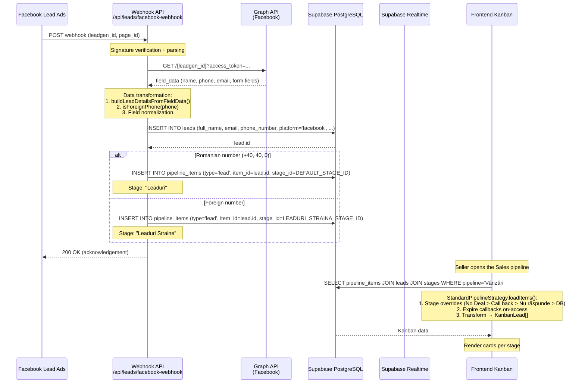
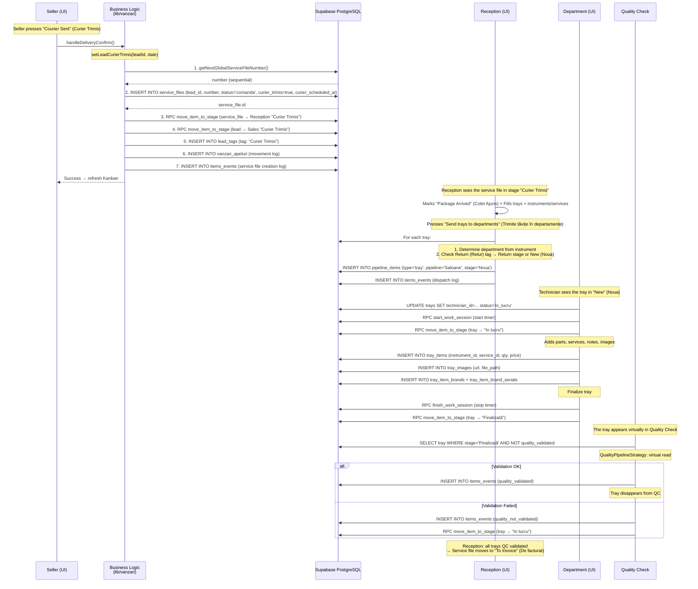
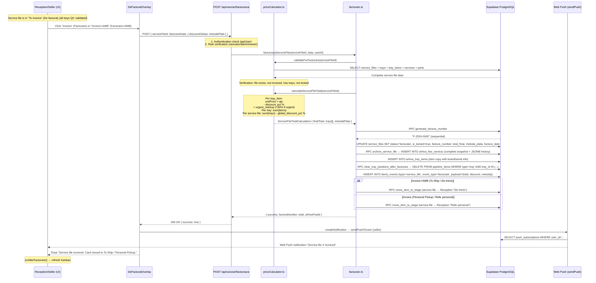
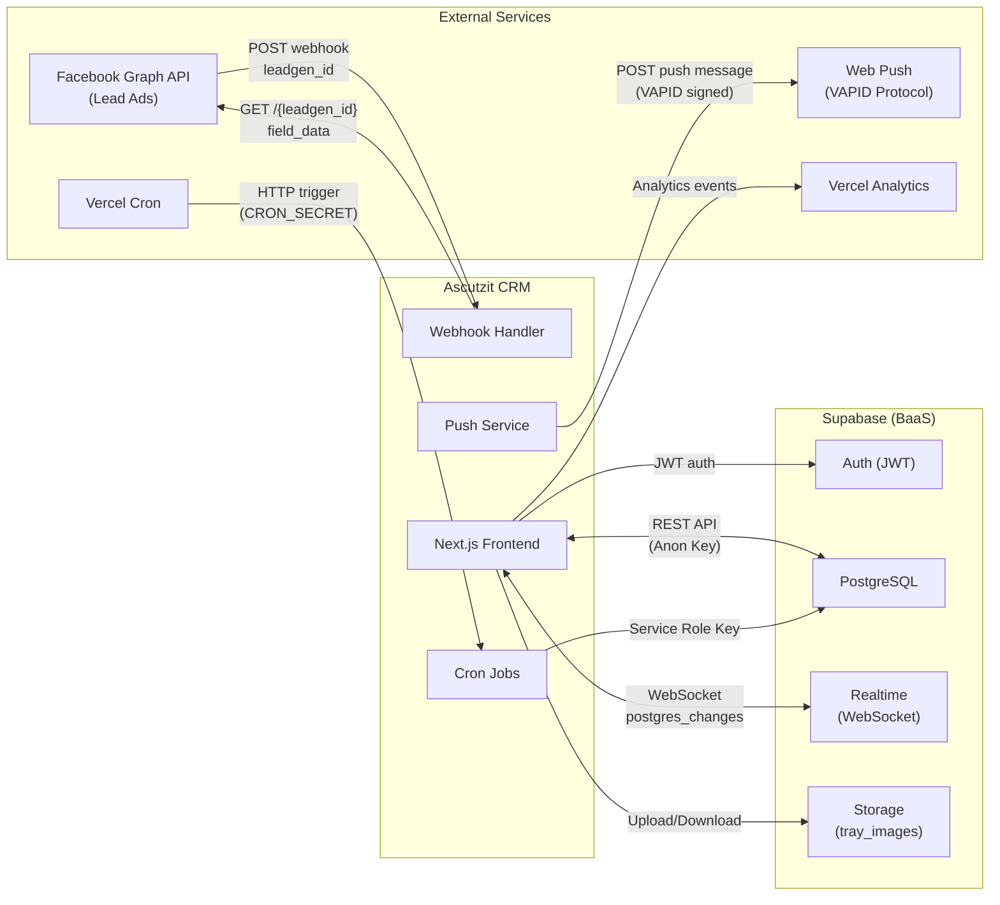

# Database Analysis, Data Flows and Integrations

---

## 1. Database Schema

### 1.1 Entity-Relationship Diagram (Mermaid)

```mermaid
erDiagram
    %% ===== CORE ENTITIES =====

    auth_users {
        uuid id PK
        text email
        jsonb user_metadata
    }

    app_members {
        uuid user_id PK,FK
        text role "owner|admin|member|vanzator|receptie|tehnician"
        text name
        text technician_status "disponibil|ocupat"
        uuid current_tray_id FK
        text job_type
        boolean is_active
    }

    user_preferences {
        uuid id PK
        uuid user_id FK,UK
        jsonb preferences
    }

    user_pipeline_permissions {
        uuid id PK
        uuid user_id FK
        uuid pipeline_id FK
    }

    %% ===== PIPELINE SYSTEM =====

    pipelines {
        uuid id PK
        varchar name UK
        text description
        integer position
        boolean is_active
        uuid created_by FK
    }

    stages {
        uuid id PK
        uuid pipeline_id FK
        varchar name
        integer position
        boolean is_active
        text color
        jsonb config
    }

    pipeline_items {
        uuid id PK
        text type "lead|service_file|tray"
        uuid item_id
        uuid pipeline_id FK
        uuid stage_id FK
        timestamp created_at
        timestamp updated_at
    }

    %% ===== LEADS & SALES =====

    leads {
        uuid id PK
        varchar full_name
        varchar email
        varchar phone_number
        varchar platform "facebook|manual"
        varchar campaign_name
        varchar form_name
        boolean call_back
        timestamp callback_date
        boolean nu_raspunde
        timestamp nu_raspunde_callback_at
        boolean no_deal
        timestamp no_deal_at
        text details
        text city
        text company_name
        text billing_cui
        uuid claimed_by FK
        uuid created_by FK
        uuid curier_trimis_user_id FK
        uuid office_direct_user_id FK
        timestamp curier_trimis_at
        timestamp office_direct_at
    }

    tags {
        uuid id PK
        text name UK
        text color "green|yellow|red|orange|blue"
    }

    lead_tags {
        uuid lead_id PK,FK
        uuid tag_id PK,FK
    }

    vanzari_apeluri {
        uuid id PK
        uuid lead_id FK
        uuid pipeline_id FK
        uuid from_stage_id FK
        uuid to_stage_id FK
        uuid moved_by FK
        timestamp apel_at
    }

    %% ===== SERVICE FILES =====

    service_files {
        uuid id PK
        uuid lead_id FK
        text number
        date date
        text status "noua|in_lucru|finalizata|comanda|facturata"
        boolean office_direct
        boolean curier_trimis
        boolean colet_neridicat
        boolean colet_ajuns
        boolean retur
        boolean urgent
        boolean no_deal
        boolean cash
        boolean card
        numeric global_discount_pct
        boolean is_locked
        timestamp curier_scheduled_at
        timestamp archived_at
        text subscription_type
        jsonb technician_details
    }

    %% ===== TRAYS =====

    trays {
        uuid id PK
        text number
        uuid service_file_id FK
        text status "in_receptie|in_lucru|gata"
        text availability_status "disponibil|indisponibil|assigned|finished"
        uuid technician_id FK
        uuid technician2_id FK
        uuid technician3_id FK
        uuid parent_tray_id FK
        integer priority
        text qc_notes
    }

    tray_items {
        uuid id PK
        uuid tray_id FK
        uuid department_id FK
        uuid instrument_id FK
        uuid service_id FK
        uuid part_id FK
        uuid technician_id FK
        uuid technician2_id FK
        uuid technician3_id FK
        integer qty
        real discount
        integer unrepaired_qty
        boolean guaranty
        text serials
    }

    tray_images {
        uuid id PK
        uuid tray_id FK
        text url
        text file_path
        text filename
    }

    tray_item_brands {
        uuid id PK
        uuid tray_item_id FK
        text brand
        boolean garantie
    }

    tray_item_brand_serials {
        uuid id PK
        uuid brand_id FK
        text serial_number
    }

    %% ===== CATALOG =====

    departments {
        uuid id PK
        text name "reparatii|ascutire"
    }

    instruments {
        uuid id PK
        text name
        uuid department_id FK
        uuid pipeline FK
        boolean active
        uuid created_by FK
    }

    services {
        uuid id PK
        text name
        numeric price
        integer time
        uuid instrument_id FK
        uuid department_id FK
        boolean active
        uuid created_by FK
    }

    parts {
        uuid id PK
        text name
        numeric price
        text model
        boolean active
        uuid created_by FK
    }

    %% ===== COMMUNICATION =====

    conversations {
        uuid id PK
        text type "direct|lead|service_file|general"
        uuid related_id
        uuid created_by FK
        timestamp last_message_at
    }

    messages {
        uuid id PK
        uuid conversation_id FK
        uuid sender_id FK
        text content
        text message_type "text|file|system|image"
        uuid image_id FK
        boolean has_attachments
    }

    notifications {
        uuid id PK
        uuid user_id FK
        text type
        text title
        text message
        jsonb data
        boolean read
        timestamp read_at
    }

    push_subscriptions {
        uuid id PK
        uuid user_id FK
        text endpoint UK
        text p256dh
        text auth
    }

    %% ===== HISTORY & AUDIT =====

    items_events {
        uuid id PK
        text type "lead|service_file|tray"
        uuid item_id
        text event_type
        text message
        jsonb payload
        uuid actor_id FK
        text actor_name
    }

    stage_history {
        uuid id PK
        uuid lead_id FK
        uuid tray_id FK
        uuid service_file_id FK
        uuid pipeline_id FK
        uuid from_stage_id FK
        uuid to_stage_id FK
        uuid moved_by FK
        timestamp moved_at
    }

    audit_log {
        uuid id PK
        text table_name
        uuid record_id
        text operation
        jsonb old_data
        jsonb new_data
        uuid actor_id FK
    }

    %% ===== WORK SESSIONS =====

    technician_work_sessions {
        uuid id PK
        uuid tray_id FK
        uuid technician_id FK
        timestamp started_at
        timestamp finished_at
    }

    %% ===== ARCHIVE =====

    arhiva_fise_serviciu {
        uuid id PK
        uuid lead_id FK
        text number
        text status
        jsonb istoric
        jsonb technician_details
        timestamp archived_at
    }

    arhiva_tray_items {
        uuid id PK
        uuid arhiva_fisa_id FK
        uuid department_id FK
        uuid instrument_id FK
        uuid service_id FK
        uuid part_id FK
        uuid technician_id FK
        numeric qty
        text info
    }

    seller_statistics {
        uuid id PK
        uuid user_id FK
        text metric_name
        numeric metric_value
    }

    %% ===== RELATIONSHIPS =====

    auth_users ||--o| app_members : "1:1 profile"
    auth_users ||--o| user_preferences : "1:1 preferences"
    auth_users ||--o{ user_pipeline_permissions : "1:N permissions"
    auth_users ||--o{ push_subscriptions : "1:N subscriptions"
    auth_users ||--o{ notifications : "1:N notifications"

    pipelines ||--|{ stages : "1:N stages"
    pipelines ||--o{ pipeline_items : "1:N items"
    pipelines ||--o{ user_pipeline_permissions : "1:N permissions"

    stages ||--o{ pipeline_items : "1:N items"

    leads ||--o{ service_files : "1:N service files (fișe)"
    leads ||--o{ lead_tags : "M:N tags"
    leads ||--o{ vanzari_apeluri : "1:N calls"
    leads ||--o{ stage_history : "1:N history"
    leads ||--o| arhiva_fise_serviciu : "1:N archive"

    tags ||--o{ lead_tags : "M:N leads"

    service_files ||--|{ trays : "1:N trays (tăvițe)"
    service_files ||--o{ stage_history : "1:N history"

    trays ||--|{ tray_items : "1:N items"
    trays ||--o{ tray_images : "1:N images"
    trays ||--o{ technician_work_sessions : "1:N sessions"
    trays ||--o{ stage_history : "1:N history"
    trays ||--o| trays : "self-ref parent (split)"

    tray_items ||--o{ tray_item_brands : "1:N brands"
    tray_item_brands ||--o{ tray_item_brand_serials : "1:N serials"

    departments ||--o{ instruments : "1:N instruments"
    departments ||--o{ services : "1:N services"

    instruments ||--|{ services : "1:N services"
    instruments ||--o{ tray_items : "1:N references"

    app_members ||--o{ trays : "1:N (technician_id)"

    conversations ||--|{ messages : "1:N messages"

    arhiva_fise_serviciu ||--|{ arhiva_tray_items : "1:N archive items"
```

### 1.2 Entity Classification and Cardinality

#### Business Core (Main Flow)

| Entity | PK | Key Relationships | Description |
| :--- | :--- | :--- | :--- |
| **leads** | `id` (uuid) | → `service_files` (1:N), → `lead_tags` (M:N), → `vanzari_apeluri` (1:N) | Client/request – the central entity |
| **service_files** | `id` (uuid) | → `leads.id` (FK), → `trays` (1:N) | Service file (fișă de service) – created upon delivery confirmation |
| **trays** | `id` (uuid) | → `service_files.id` (FK), → `tray_items` (1:N), → self (`parent_tray_id`) | Tray (tăviță) with instruments – physical container |
| **tray_items** | `id` (uuid) | → `trays.id`, → `instruments.id`, → `services.id`, → `parts.id`, → `departments.id` | Line item: instrument + service + part |

#### Kanban Pipeline System

| Entity | PK | Key Relationships | Description |
| :--- | :--- | :--- | :--- |
| **pipelines** | `id` (uuid) | → `stages` (1:N) | Pipeline: Sales (Vânzări), Reception (Recepție), Salons (Saloane), Horeca, Barbershops (Frizerii), Repairs (Reparatii), Quality |
| **stages** | `id` (uuid) | → `pipelines.id` (FK) | Stage in pipeline (e.g.: Leads (Leaduri), No Deal, In Progress (In lucru)) |
| **pipeline_items** | `id` (uuid) | → `pipelines.id`, → `stages.id` | Item position (lead/service file/tray) in pipeline + stage |

#### Catalog

| Entity | PK | Key Relationships | Description |
| :--- | :--- | :--- | :--- |
| **departments** | `id` (uuid) | → `instruments` (1:N), → `services` (1:N) | Department: repairs (reparatii), sharpening (ascutire) |
| **instruments** | `id` (uuid) | → `departments.id`, → `pipelines.id`, → `services` (1:N) | Catalog instrument (e.g.: Cuticle scissors (Forfecuță cuticule)) |
| **services** | `id` (uuid) | → `instruments.id`, → `departments.id` | Service per instrument (e.g.: Sharpening (Ascuțire)) |
| **parts** | `id` (uuid) | - | Spare part |
| **tray_item_brands** | `id` (uuid) | → `tray_items.id` | Brand per item (e.g.: Jaguar) |
| **tray_item_brand_serials** | `id` (uuid) | → `tray_item_brands.id` | Serial numbers per brand |

#### Users and Permissions

| Entity | PK | Key Relationships | Description |
| :--- | :--- | :--- | :--- |
| **auth.users** | `id` (uuid) | Supabase Auth built-in | Authentication account |
| **app_members** | `user_id` (uuid, FK) | 1:1 with `auth.users` | Application profile (role, status, job) |
| **user_pipeline_permissions** | `id` (uuid) | → `auth.users.id`, → `pipelines.id` | Pipeline access permission |
| **user_preferences** | `id` (uuid) | → `auth.users.id` (UK) | User preferences (JSON) |

#### Communication and Notifications

| Entity | PK | Key Relationships | Description |
| :--- | :--- | :--- | :--- |
| **conversations** | `id` (uuid) | → `messages` (1:N), `related_id` → lead/service file | Conversation: lead, service_file, direct, general |
| **messages** | `id` (uuid) | → `conversations.id`, → `auth.users` (sender) | Message: text, image, file, system |
| **notifications** | `id` (uuid) | → `auth.users.id` | In-app notification |
| **push_subscriptions** | `id` (uuid) | → `auth.users.id` | Web Push subscription (VAPID) |

#### Audit and History

| Entity | PK | Key Relationships | Description |
| :--- | :--- | :--- | :--- |
| **items_events** | `id` (uuid) | `item_id` → lead/service file/tray (polymorphic) | Event journal per item |
| **stage_history** | `id` (uuid) | → lead/tray/service_file, → pipeline, → stages | Stage movement history |
| **audit_log** | `id` (uuid) | - | General audit (table, record, operation) |
| **vanzari_apeluri** | `id` (uuid) | → `leads.id`, → stages | Movement journal in Sales (Vânzări) pipeline |
| **technician_work_sessions** | `id` (uuid) | → `trays.id` | Technician work sessions |
| **seller_statistics** | `id` (uuid) | → `auth.users.id` | Aggregated seller statistics |

#### Archive

| Entity | PK | Key Relationships | Description |
| :--- | :--- | :--- | :--- |
| **arhiva_fise_serviciu** | `id` (uuid) | → `leads.id` | Service file snapshot at the time of invoicing |
| **arhiva_tray_items** | `id` (uuid) | → `arhiva_fise_serviciu.id` | Tray items snapshot at archiving |

### 1.3 Critical Fields and Implicit Indexes

- **All PKs** are `uuid` generated with `gen_random_uuid()`.
- **Foreign Keys** with implicit CASCADE through Supabase.
- **Unique constraints**: `leads.lead_id`, `pipelines.name`, `tags.name`, `push_subscriptions.endpoint`, `user_preferences.user_id`.
- **Check constraints**: `app_members.technician_status`, `departments.name`, `conversations.type`, `messages.message_type`, `tags.color`, `trays.availability_status`.
- **Polymorphic references**: `pipeline_items.type` + `item_id` (lead/service_file/tray), `items_events.type` + `item_id`.
- **Self-referential**: `trays.parent_tray_id` → `trays.id` (for split trays).

---

## 2. Data Flows (3 Main Features)

### 2.1 Flow 1: Lead Capture from Facebook → Display in Sales Kanban

**Data transformations:**
1. **Facebook → CRM**: `field_data` (array `{name, values}`) → lead fields (`full_name`, `phone_number`, `email`, `details`).
2. **Phone normalization**: `isForeignPhone()` → lead classification into Leads (Leaduri) vs Foreign Leads (Leaduri Straine).
3. **DB → UI**: `pipeline_items` + `leads` → `KanbanLead` (join + stage override + tag enrichment).

---

### 2.2 Flow 2: Delivery Confirmation → Service File Creation → Send Trays → Completion

**Data transformations:**
1. **UI → DB**: Delivery form data → `service_files` row + `pipeline_items` + `lead_tags` + `vanzari_apeluri`.
2. **Tray dispatch**: Instruments → department determination (Salons (Saloane)/Horeca/Barbershops (Frizerii)/Repairs (Reparatii)) → `pipeline_items` per tray.
3. **Quality Check**: Virtual read from department `pipeline_items` (stage Finalized (Finalizată)) + `items_events` filtering → display without own rows in `pipeline_items`.

---

### 2.3 Flow 3: Invoicing → Archiving → Notification

**Data transformations:**
1. **UI → API**: `{ serviceFileId, facturareData }` → implicit Zod validation.
2. **Price calculation**: `tray_items` (qty, price, discount) → `ItemTotalCalculation` → `TrayTotalCalculation` → `ServiceFileTotalCalculation` with urgent markup +30%.
3. **Archiving**: `service_files` + `trays` + `tray_items` + `stage_history` + `items_events` + `messages` → complete JSONB snapshot in `arhiva_fise_serviciu.istoric`.
4. **Notification**: `createNotification` → insert `notifications` + `sendPushToUser` (web-push VAPID to all user subscriptions).

---

## 3. API Endpoints and External Integrations

### 3.1 Internal Endpoints (48 route handlers)

#### Leads & Sales

| Method | Endpoint | Permissions | Description |
| :--- | :--- | :--- | :--- |
| GET/POST | `/api/leads/facebook-webhook` | Public (verify token) | Facebook Lead Ads webhook + subscription verification |
| POST | `/api/leads/simulate-facebook` | Dev/Secret | Simulate Facebook lead (testing) |
| POST | `/api/leads/expire-callbacks` | Authenticated | Expire callback/nu_raspunde (on-access) |
| POST | `/api/leads/move-to-colet-neridicat` | Authenticated | Move service files to Uncollected Package (Colet Neridicat) |
| POST | `/api/leads/move-with-service-files` | Authenticated | Move lead + service files between stages |
| GET | `/api/vanzari/add-suna-tag` | Admin (CRON_SECRET) | Add "Call!" (Sună!) tag to expired leads |
| POST | `/api/vanzari/factureaza` | Seller/Admin/Owner | Complete service file invoicing |
| POST | `/api/vanzari/anuleaza-factura` | Admin/Owner | Cancel invoice (mandatory reason) |
| GET | `/api/vanzari/statistics` | Seller/Admin/Owner | Advanced sales statistics |

#### Service Files & Trays

| Method | Endpoint | Permissions | Description |
| :--- | :--- | :--- | :--- |
| POST | `/api/service-files/set-colet-ajuns` | Service Role | Mark service file as "package arrived" (colet ajuns) |
| POST | `/api/service-files/archive-and-release` | Admin/Owner | Archive + release trays (atomic) |
| GET | `/api/trays/check-department-status` | Authenticated | Check tray status in departments |

#### Cron Jobs

| Method | Endpoint | Frequency | Description |
| :--- | :--- | :--- | :--- |
| GET | `/api/cron/midnight-ro` | Daily 22:00 UTC | No Deal → Archived (24h) |
| GET | `/api/cron/curier-to-avem-comanda` | Daily 01:00 UTC | Courier/Office → We Have Order (Avem Comandă) (24h) |
| POST | `/api/cron/vanzari-colet-neridicat` | Daily 23:59 | Automatic Uncollected Package (Colet Neridicat) (2 days) |
| POST | `/api/cron/vanzari-archive-no-deal` | Weekly | Archive No Deal > 30 days |
| POST | `/api/cron/vanzari-followup-reminder` | Daily 09:00 | Callback follow-up reminder |
| POST | `/api/cron/backup` | Hourly/Daily | Automatic DB backup |

#### Search

| Method | Endpoint | Description |
| :--- | :--- | :--- |
| GET | `/api/search/unified?q=...` | Unified search: leads + service files + trays (RPC `search_unified`) |
| GET | `/api/search/trays?q=...` | Tray search: number, serial, brand |

#### Push Notifications

| Method | Endpoint | Description |
| :--- | :--- | :--- |
| POST | `/api/push/subscribe` | Save Web Push subscription (upsert endpoint) |
| POST | `/api/push/test` | Test push notification |
| GET | `/api/push/vapid-public` | VAPID public key |
| GET | `/api/push/status` | Push configuration status |
| GET | `/api/push/config-check` | Full VAPID verification |

#### Admin & Owner

| Method | Endpoint | Description |
| :--- | :--- | :--- |
| POST | `/api/admin/members/add` | Create user account |
| POST | `/api/admin/members/reset-password` | Reset password |
| GET | `/api/admin/members` | Member list |
| POST | `/api/admin/sync-users` | Synchronize user_id with auth.users |
| POST | `/api/admin/sync-all-members` | Full member synchronization |
| POST | `/api/admin/backup` | Manual backup |
| GET | `/api/admin/download-backup` | Download backup |
| DELETE | `/api/admin/delete-empty-trays` | Clean up empty trays |
| POST | `/api/admin/backfill-service-file-status` | Backfill service file statuses |

#### Other Routes

| Method | Endpoint | Description |
| :--- | :--- | :--- |
| GET | `/api/pipelines` | Pipeline list |
| GET | `/api/stages` | Stage list |
| POST | `/api/notifications/create` | Create notification (service role) |
| POST | `/api/tracking` | Event tracking (click, input_change) |
| POST | `/api/profile/update-display-name` | Update display name |
| POST | `/api/auth/username-to-email` | Convert username → email (login) |
| PATCH | `/api/work-sessions/[id]` | Edit work session (owner only) |
| GET | `/api/technician-stats` | Technician statistics |
| GET | `/api/owner/db/tables` | DB table list (owner) |
| GET | `/api/owner/db/table/[tableName]` | Browse DB table (owner) |
| POST | `/api/owner/backfill-vanzari-apeluri` | Backfill sales calls (vanzari apeluri) |
| POST | `/api/owner/atribuie-apel-manual` | Manually assign call |
| POST | `/api/owner/correct-curier-trimis-dates` | Correct courier dates |
| POST | `/api/setup/permissions` | Initial permissions setup |

### 3.2 External Integrations

#### Facebook Graph API

| Direction | Data | Details |
| :--- | :--- | :--- |
| **Receive** (webhook) | `leadgen_id`, `page_id`, `form_id` | Facebook sends POST for each new lead |
| **Send** (fetch lead) | Request: `GET /{leadgen_id}?fields=...&access_token=PAGE_ACCESS_TOKEN` | CRM calls Graph API for complete data |
| **Receive** (response) | `field_data[]` (name, phone, email, custom fields), `custom_disclaimer_responses[]` | Data parsed and inserted into `leads` |
| **Env vars** | `FACEBOOK_PAGE_ACCESS_TOKEN`, `FACEBOOK_VERIFY_TOKEN` | Webhook and Graph API authentication |

#### Web Push (VAPID Protocol)

| Direction | Data | Details |
| :--- | :--- | :--- |
| **Browser → CRM** | `PushSubscription { endpoint, keys: { p256dh, auth } }` | Saved in `push_subscriptions` |
| **CRM → Push Service** | `{ title, body, url, tag, icon }` signed with `VAPID_PRIVATE_KEY` | Sent via `web-push` library |
| **Push Service → Browser** | Native notification (popup/banner) | Automatically displayed by browser |
| **Env vars** | `NEXT_PUBLIC_VAPID_PUBLIC_KEY`, `VAPID_PRIVATE_KEY` | VAPID keys generated with `npx web-push generate-vapid-keys` |

#### Supabase

| Service | Usage | Details |
| :--- | :--- | :--- |
| **Auth** | JWT tokens, session management, password reset | Cookie refresh via middleware; 6 custom roles |
| **PostgreSQL** | All business data (26+ tables) | Access: Anon Key (client, RLS) + Service Role Key (server, bypass RLS) |
| **Realtime** | WebSocket subscriptions on `items_events`, `tags`, notifications | `postgres_changes` → INSERT/UPDATE events |
| **Storage** | Bucket `tray_images` | Upload/download tray images |
| **RPC** | 21+ PostgreSQL functions | `move_item_to_stage`, `generate_factura_number`, `search_unified`, etc. |

#### Vercel

| Service | Usage | Details |
| :--- | :--- | :--- |
| **Hosting** | Next.js SSR + Edge | App Router, serverless functions |
| **Cron** | 2 cron jobs in `vercel.json` (midnight-ro, curier-to-avem-comanda) | + 4 manual/custom triggered cron jobs |
| **Analytics** | `@vercel/analytics` | Page views, web vitals |

### 3.3 PostgreSQL RPC Functions (21 server-side functions)

| RPC | Input → Output | Description |
| :--- | :--- | :--- |
| `move_item_to_stage` | `(type, item_id, pipeline_id, new_stage_id)` → success | Atomic move + stage_history logging |
| `generate_factura_number` | `()` → text | Sequential invoice number (F-YYYY-NNNN) |
| `archive_service_file` | `(service_file_id)` → arhiva_id | Complete snapshot to archive |
| `clear_tray_positions_after_facturare` | `(tray_ids[])` → void | Remove trays from pipeline_items |
| `release_trays_on_archive` | `(tray_ids[], service_file_id)` → void | Release trays on archiving |
| `start_work_session` | `(tray_id, tech_id)` → session_id | Start timer (idempotent) |
| `finish_work_session` | `(tray_id, tech_id)` → void | Stop timer |
| `get_technician_work_minutes` | `(tech_id, start, end)` → minutes | Minutes worked in interval |
| `get_technician_dashboard_bulk` | `(tech_ids[])` → bulk_data | Technician dashboard data (1 call) |
| `get_expired_callback_leads` | `()` → lead_ids[] | Leads with expired callback |
| `get_expired_nu_raspunde_leads` | `()` → lead_ids[] | Leads with expired no-answer (nu_raspunde) |
| `get_user_pipeline_permissions` | `(user_id)` → pipeline_ids[] | Pipeline permissions |
| `get_pipeline_options` | `()` → pipelines[] | Available pipeline options |
| `get_dashboard_stats` | `()` → stats | Aggregated dashboard statistics |
| `get_vanzari_apeluri_counts_by_month` | `(months)` → counts[] | Call counts per month |
| `search_unified` | `(query)` → results[] | Unified search (lead/service file/tray) |
| `split_tray_to_real_trays` | `(tray_id, tech_assignments)` → new_tray_ids[] | Split tray between technicians |
| `merge_split_trays_if_all_finalized` | `(parent_tray_id)` → merged | Merge finalized split trays |
| `consolidate_tray_items` | `(tray_id)` → void | Consolidate duplicate items |
| `increment_seller_statistic` | `(user_id, metric, value)` → void | Increment seller statistic |
| `update_pipeline_and_reorder_stages` | `(pipeline_id, stages[])` → void | Update + reorder stages |

---

*Report generated based on the SQL schema from `docs/sql data base.md`, TypeScript types from `lib/types/` and source code analysis.*
