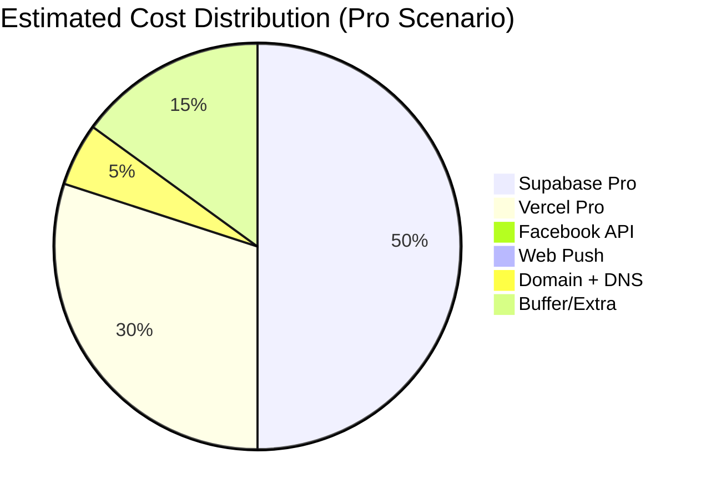

# Infrastructure, Scalability & Cost Estimation – Ascutzit CRM

---

## 1. Identified Cloud Resources

### 1.1 Services Used

The project uses a **serverless BaaS** (Backend-as-a-Service) architecture, with no self-hosted infrastructure:

| Service | Provider | Role | Configuration in Code |
| :--- | :--- | :--- | :--- |
| **Vercel** | Vercel Inc. | Hosting (SSR + Serverless Functions + Edge) | `vercel.json`, `next.config.mjs` |
| **Supabase PostgreSQL** | Supabase (AWS) | Relational database (26+ tables) | `NEXT_PUBLIC_SUPABASE_URL` |
| **Supabase Auth** | Supabase | JWT authentication + sessions | `@supabase/ssr`, `middleware.ts` |
| **Supabase Realtime** | Supabase | WebSocket subscriptions (4 active channels) | `supabase.channel(...)` in 11 files |
| **Supabase Storage** | Supabase (AWS S3) | `tray_images` bucket (tray photos) | `lib/supabase/imageOperations.ts` |
| **Supabase RPC** | Supabase | 21+ server-side PostgreSQL functions | `.rpc('move_item_to_stage', ...)` |
| **Vercel Cron** | Vercel | 2 scheduled cron jobs | `vercel.json` |
| **Vercel Analytics** | Vercel | Web Vitals + page views | `<Analytics />` in `layout.tsx` |
| **Facebook Graph API** | Meta | Lead Ads webhook (lead capture) | `app/api/leads/facebook-webhook/route.ts` |
| **Web Push Protocol** | W3C Standard | Browser push notifications (VAPID) | `lib/push/sendPush.ts`, `web-push` npm |

### 1.2 Infrastructure as Code

| Type | Status |
| :--- | :--- |
| Terraform / OpenTofu | **DOES NOT EXIST** |
| CloudFormation | **DOES NOT EXIST** |
| Docker / Docker Compose | **DOES NOT EXIST** |
| Kubernetes / Helm | **DOES NOT EXIST** |
| Pulumi / CDK | **DOES NOT EXIST** |
| `vercel.json` | **YES** – minimal configuration (only cron jobs) |

All infrastructure is managed services. No replicable IaC configurations exist. Creating a new instance requires manual setup on Supabase Dashboard + Vercel Dashboard.

---

## 2. Infrastructure Diagram

```
┌──────────────────────────────────────────────────────────────────────────┐
│                            INTERNET                                       │
│                                                                           │
│  ┌─────────┐    ┌──────────────┐    ┌──────────────────────────────────┐ │
│  │ Browser │    │ Facebook CDN │    │ Push Service (Google/Apple/Moz.) │ │
│  │ (React) │    │  (Webhook)   │    │   (Web Push Protocol)           │ │
│  └────┬────┘    └──────┬───────┘    └───────────────────▲──────────────┘ │
│       │                │                                 │                │
└───────┼────────────────┼─────────────────────────────────┼────────────────┘
        │                │                                 │
        ▼                ▼                                 │
┌───────────────────────────────────────────────┐          │
│              VERCEL (Edge Network)             │          │
│                                                │          │
│  ┌──────────────────────────────────────────┐ │          │
│  │ CDN / Edge (HTML, JS, CSS, Images)       │ │          │
│  │ - Image Optimization (AVIF/WebP)         │ │          │
│  │ - Static Assets (30d cache)              │ │          │
│  └──────────────────────────────────────────┘ │          │
│                                                │          │
│  ┌──────────────────────────────────────────┐ │          │
│  │ Serverless Functions (Node.js)           │ │          │
│  │ - 48 API Routes                          │ │          │
│  │ - Middleware (auth refresh)              │──┤          │
│  │ - SSR Pages                              │ │          │
│  │ - Max execution: 10s (Hobby) / 60s (Pro)│ │          │
│  └──────────────────────────────────────────┘ │          │
│                                                │          │
│  ┌──────────────────────────────────────────┐ │          │
│  │ Vercel Cron (2 jobs)                     │ │          │
│  │ - midnight-ro: 0 22 * * *               │ │          │
│  │ - curier-to-avem-comanda: 0 1 * * *     │ │          │
│  └──────────────────────────────────────────┘ │          │
│                                                │          │
│  ┌──────────────────────────────────────────┐ │          │
│  │ Vercel Analytics (Web Vitals)            │ │          │
│  └──────────────────────────────────────────┘ │          │
└────────────────────────┬──────────────────────┘          │
                         │                                  │
                         ▼                                  │
┌──────────────────────────────────────────────┐           │
│            SUPABASE (AWS eu-central-1)        │           │
│                                               │           │
│  ┌─────────────────────────────────────────┐ │           │
│  │ PostgreSQL (26+ tables, 21+ RPC)        │ │           │
│  │ - ~5-50 concurrent connections          │ │           │
│  │ - Row Level Security (RLS)              │ │           │
│  │ - Connection pooling (PgBouncer)        │ │           │
│  └─────────────────────────────────────────┘ │           │
│                                               │           │
│  ┌─────────────────────────────────────────┐ │           │
│  │ Auth (JWT, sessions, users)             │ │           │
│  └─────────────────────────────────────────┘ │           │
│                                               │           │
│  ┌─────────────────────────────────────────┐ │           │
│  │ Realtime (WebSocket, 4 channels)        │ │           │
│  │ - postgres_changes: items_events, tags  │ │           │
│  │ - Concurrent connections: ~5-20         │ │           │
│  └─────────────────────────────────────────┘ │           │
│                                               │           │
│  ┌─────────────────────────────────────────┐ │           │
│  │ Storage (S3-backed)                     │──────────────┘
│  │ - Bucket: tray_images                   │ │  (push via
│  │ - Public URLs                           │ │   sendPush)
│  └─────────────────────────────────────────┘ │
└──────────────────────────────────────────────┘
```

---

## 3. Scalability

### 3.1 What Scales Automatically

| Component | Scaling | Limit |
| :--- | :--- | :--- |
| **Vercel Serverless Functions** | Auto-scale (concurrent, per-request) | Hobby: 10s exec, 12 deploys/day; Pro: 60s exec, unlimited |
| **Vercel Edge CDN** | Global, auto | Unlimited on Pro |
| **Supabase Auth** | Managed, auto | 50k MAU on Free; unlimited on Pro |
| **Supabase Storage** | S3-backed, auto | 1GB Free; 100GB Pro; pay per extra GB |

### 3.2 What Does NOT Scale Automatically (Bottlenecks)

#### Bottleneck 1: PostgreSQL Connections (CRITICAL)

**Problem:** Each Serverless Function opens a PostgreSQL connection. Under heavy traffic, connections can be exhausted.

- Supabase Free: **max 60 direct connections** (PgBouncer: 200 pooled)
- Supabase Pro: **max 200 direct connections** (PgBouncer: 400 pooled)
- The project does NOT explicitly configure application-level connection pooling

**Estimated current usage:**
- 1 active user = ~3-5 connections (Kanban load + Realtime + details panel)
- 10 simultaneous users = ~30-50 connections → **approaching Free limit**
- 20 simultaneous users = ~60-100 connections → **requires Pro**

#### Bottleneck 2: Reception Strategy – N Queries per Load (HIGH)

**Problem:** `receptie.ts` makes **~25 sequential queries** on every Reception pipeline load. Each round-trip adds ~20-50ms latency.

- 25 queries × 30ms = **~750ms per load** (estimated)
- With 5 Reception users refreshing simultaneously = 125 queries/s
- No pagination: all service files are loaded at once

**Recommendation:** Consolidate into a single RPC `get_receptie_dashboard(pipeline_id)` that returns everything with server-side JOINs. Reduces from 25 round-trips to 1.

#### Bottleneck 3: Sequential Cron Jobs (MEDIUM)

**Problem:** Crons use `for...of { await rpc() }` – N sequential DB calls per lead.
- 100 No Deal leads = ~100 × 3 calls = 300 DB calls = **~15-30 seconds**
- Vercel Hobby timeout: **10 seconds** → cron may be forcefully terminated!
- Vercel Pro timeout: 60 seconds → safer but still inefficient

#### Bottleneck 4: Realtime Connections (MEDIUM)

**Problem:** Each open browser tab creates 1-4 Supabase WebSocket channels.
- Supabase Free: **200 concurrent Realtime connections**
- Supabase Pro: **500 concurrent Realtime connections**
- 10 users × 3 tabs × 3 channels = ~90 connections → OK
- 50 users × 2 tabs × 3 channels = ~300 connections → **exceeds Free**

#### Bottleneck 5: Supabase Storage – Unsorted Images (LOW)

**Problem:** All images are in the `tray_images` bucket with path `{trayId}/{timestamp}.{ext}`. No intermediate CDN or on-the-fly transformations.
- At 10,000 trays × 5 images/tray = ~50,000 files
- Supabase Storage: S3-backed, performance OK
- But direct download from Storage (without CDN) can be slow on mobile

### 3.3 Estimated Traffic Profile

| Scenario | Simultaneous Users | DB Connections | Realtime | Storage |
| :--- | :--- | :--- | :--- | :--- |
| **Current** (small team) | 5-10 | ~15-50 | ~15-40 | <1 GB |
| **2x Growth** | 10-20 | ~30-100 | ~30-80 | 1-5 GB |
| **5x Growth** | 25-50 | ~75-250 | ~75-200 | 5-20 GB |
| **Free tier limit** | ~15 | ~60 | ~200 | 1 GB |
| **Pro tier limit** | ~50-80 | ~200-400 | ~500 | 100 GB |

---

## 4. Cost Estimation

### 4.1 Cost Components



### 4.2 Scenario 1: Small Team (5-10 users) – CURRENT

| Service | Plan | Monthly Cost | What's Included |
| :--- | :--- | :--- | :--- |
| **Vercel** | Hobby (Free) | **$0** | 1 deploy, 100GB bandwidth, serverless, 10s exec limit |
| **Supabase** | Free | **$0** | 500MB DB, 1GB storage, 50k MAU, 200 Realtime connections |
| **Facebook API** | Free | **$0** | Free webhooks, free Graph API |
| **Web Push** | Free (VAPID) | **$0** | Free protocol, no intermediary |
| **Domain** | External | **~$12/year** | ≈ $1/month |
| **Total** | | **~$1/month** | |

**Risks on Free plan:**
- Vercel: 10s function timeout – crons may fail
- Supabase: 500MB DB – at ~10,000 leads + history may be insufficient
- Supabase: 1GB storage – at ~5,000 tray images may be insufficient
- Supabase: DB pauses after 1 week of inactivity (Free tier)

### 4.3 Scenario 2: Growth (10-30 users) – RECOMMENDED

| Service | Plan | Monthly Cost | What's Included |
| :--- | :--- | :--- | :--- |
| **Vercel** | Pro | **$20/user** (min $20) | 60s exec, native Cron, 1TB bandwidth, preview deploys |
| **Supabase** | Pro | **$25** | 8GB DB, 100GB storage, 100k MAU, 500 Realtime conn. |
| **Supabase** | Compute add-on (Small) | **+$10** | Dedicated CPU/RAM for DB (avoids cold start) |
| **Domain** | External | **~$1** | |
| **Total** | | **~$56/month** | |

### 4.4 Scenario 3: Scale (30-80 users, multi-location)

| Service | Plan | Monthly Cost | What's Included |
| :--- | :--- | :--- | :--- |
| **Vercel** | Pro + seats | **$20 × N** | $20 per active seat |
| **Supabase** | Pro + compute | **$25 + $50** | Medium compute, 8GB+ DB |
| **Supabase** | Extra storage | **~$10-50** | $0.021/GB over 100GB |
| **Supabase** | Extra Realtime | **~$10** | Over 500 connections |
| **Monitoring** (Sentry) | Team | **$26** | 50k events/month |
| **Total** | | **~$160-300/month** | Depends on Vercel seat count |

### 4.5 Most Expensive Components (at Scale)

| Rank | Component | Why It Costs | Possible Optimization |
| :--- | :--- | :--- | :--- |
| **1** | **Vercel Pro seats** ($20/seat) | Every dev who deploys costs $20/month | Limit to 2-3 devs with deploy access |
| **2** | **Supabase DB compute** ($10-200) | At 50+ users, the free/base DB can't keep up | Optimize queries (reduce N+1), connection pooling |
| **3** | **Supabase Storage** ($0.021/GB) | Tray images accumulate | Compress images on upload, lifecycle policy (delete after archiving) |
| **4** | **Supabase Realtime** | Each tab = 1-4 WebSocket connections | Reduce channels (single multiplexed channel), unsubscribe on blur |
| **5** | **Vercel Serverless execution** | 48 API routes × requests | The in-memory cache (60s TTL) already helps, but not enough at scale |

---

## 5. Recommendations

### 5.1 Cost-Efficient Optimizations (No Architecture Change)

| Action | Savings | Effort |
| :--- | :--- | :--- |
| **Batch RPC for cron jobs** | Avoids 10s timeout on Hobby → no forced upgrade to Pro | 1 day |
| **Consolidate Reception queries** (1 RPC vs 25 queries) | Reduces DB load by ~90%, extends Free tier viability | 2-3 days |
| **Compress images on upload** (client-side resize to max 1920px) | Reduces storage by ~60-70% | 1 day |
| **Unsubscribe Realtime on blur** (document.hidden) | Reduces Realtime connections by ~50% | 2-3 hours |
| **Kanban pagination** (max 50 cards per stage, load-more) | Reduces payload + query time | 3-5 days |

### 5.2 When to Upgrade

| Signal | Action |
| :--- | :--- |
| Cron jobs fail (10s timeout) | Upgrade Vercel to **Pro** ($20) or batch RPC |
| DB exceeds 500MB | Upgrade Supabase to **Pro** ($25) |
| >15 simultaneous users | Upgrade Supabase to **Pro** (DB connections) |
| >5,000 tray images | Upgrade Supabase storage or add compression |
| Supabase DB pauses (Free tier) | Upgrade to Pro (always-on) |

### 5.3 Ideal Scenario at Scale (50+ users)

```
Vercel Pro ($20/seat × 3 devs)               = $60
Supabase Pro + Medium Compute                 = $75
Supabase Storage (50GB)                       = $25 included
Sentry Team (error tracking)                  = $26
Domain                                        = $1
────────────────────────────────────────────────
TOTAL                                         ≈ $187/month
```

No servers to manage, no dedicated DevOps, no OS patching. The cost is predominantly **managed services** – the biggest advantage of the serverless BaaS architecture.

---

*Report generated through analysis of code configurations, dependencies, and cloud service usage patterns of the Ascutzit CRM project.*
