# Ascutzit CRM – Technical Documentation

---

## 1. Introduction

**Ascutzit CRM** is an internal customer relationship management (CRM) platform built for a professional instrument service and repair business (salons, horeca, barbershops). The application manages the complete lifecycle of a client:

**Problem solved:** Replaces paper-based processes and fragmented communication (phone, WhatsApp, notebooks) with a centralized system that connects sales, logistics, service, and invoicing in a single Kanban dashboard.

**Business flow:**
1. **Lead capture** – automatically from Facebook Lead Ads or manually from the application.
2. **Sales (Vânzări)** – the salesperson contacts the client, negotiates, confirms delivery.
3. **Reception (Recepție)** – a service file (Fișă de service) is created, instruments/services are filled in, trays (Tăvițe) are sent to departments.
4. **Service** – specialized technicians work on trays (timer, parts, images).
5. **Quality Check** – validation of completed work.
6. **Invoicing (Facturare)** – automatic price calculation, invoice number generation, archiving.
7. **Delivery (Livrare)** – shipping via courier or personal pickup.

**Users:** Sales agents (Vânzători), Reception (Recepție), Technicians (Tehnicieni), Admin/Owner. Each role sees only the pipelines they have access to.

---

## 2. Tech Stack

### Core

| Technology | Version | Role |
| :--- | :--- | :--- |
| **Next.js** | 16.1.0 | Full-stack framework (App Router, SSR, API Routes) |
| **React** | 19.2.3 | UI rendering |
| **TypeScript** | ^5 | Type safety |
| **Supabase** | ^2.57.3 | PostgreSQL, Auth, Realtime (WebSocket), Storage |

### UI & Styling

| Technology | Version | Role |
| :--- | :--- | :--- |
| **Tailwind CSS** | ^4.1.9 | Utility-first styling |
| **Radix UI** | v1.x–2.x | 20+ accessible components (Dialog, Dropdown, Popover, etc.) |
| **Lucide React** | ^0.454.0 | Icons |
| **Recharts** | 2.15.4 | Statistics charts |
| **cmdk** | 1.0.4 | Command palette (search) |
| **sonner** | ^1.7.4 | Toast notifications |
| **vaul** | ^0.9.9 | Mobile drawer |

### Data & State

| Technology | Version | Role |
| :--- | :--- | :--- |
| **TanStack React Query** | ^5.90.12 | Server state / caching |
| **Zod** | 3.25.67 | Schema validation |
| **react-hook-form** | ^7.60.0 | Forms |
| **date-fns** | latest | Date manipulation |

### Infra & Notifications

| Technology | Version | Role |
| :--- | :--- | :--- |
| **Vercel** | - | Hosting, Cron Jobs |
| **web-push** | ^3.6.7 | Web Push Notifications (VAPID) |
| **@vercel/analytics** | latest | Page analytics |

---

## 3. Architecture

### 3.1 Logical System Diagram

```mermaid
graph TB
    subgraph External["Servicii Externe"]
        FB["Facebook Lead Ads"]
        PUSH["Web Push Protocol"]
        VCRON["Vercel Cron"]
    end

    subgraph Frontend["Next.js Frontend (React 19)"]
        AUTH_PAGE["Login Page"]
        SHELL["App Shell (Sidebar + Header)"]
        KANBAN["Kanban Board"]
        DETAILS["Lead Details Panel"]
        PRETURI["Modul Prețuri"]
        TECH["Pagina Tehnician"]
        ADMIN["Admin Dashboard"]
    end

    subgraph Backend["Next.js API Routes"]
        WEBHOOK["Facebook Webhook"]
        CRON["Cron Jobs (6)"]
        VANZARI_API["Vânzări API (facturare, statistici)"]
        SEARCH_API["Search API (unified, trays)"]
        PUSH_API["Push API (subscribe, send)"]
        ADMIN_API["Admin API (members, backup)"]
    end

    subgraph Supabase["Supabase (BaaS)"]
        PG["PostgreSQL (26+ tabele)"]
        AUTH["Supabase Auth (JWT)"]
        RT["Realtime (WebSocket)"]
        STORAGE["Storage (tray_images)"]
        RPC["RPC Functions (21+)"]
    end

    FB -->|"Webhook POST"| WEBHOOK
    WEBHOOK -->|"Graph API fetch"| FB
    VCRON -->|"HTTP + CRON_SECRET"| CRON

    AUTH_PAGE -->|"signInWithPassword"| AUTH
    SHELL --> KANBAN
    SHELL --> DETAILS
    SHELL --> PRETURI
    SHELL --> TECH
    SHELL --> ADMIN

    KANBAN <-->|"REST + RPC"| PG
    KANBAN <-->|"postgres_changes"| RT
    DETAILS -->|"CRUD"| PG
    PRETURI -->|"CRUD"| PG
    TECH -->|"upload/download"| STORAGE
    TECH -->|"work sessions"| RPC

    VANZARI_API --> PG
    VANZARI_API --> RPC
    SEARCH_API --> RPC
    PUSH_API --> PUSH
    CRON --> RPC
    ADMIN_API --> PG

    Frontend -->|"Anon Key (RLS)"| PG
    Backend -->|"Service Role Key"| PG
```



### 3.2 Simplified Data Flow

```
Lead (Facebook/Manual)
  │
  ▼
Sales Pipeline ──[Courier Sent / Office Direct]──▶ Service File (Fișă de Service)
  │                                                       │
  │ (Call Back / No Answer / No Deal)                     ▼
  │                                               Reception Pipeline
  ▼                                                       │
Archived (automatic 24h/30 days)                  [Send trays]
                                                          │
                                                          ▼
                                                  Department Pipeline
                                                  (Salons/Horeca/Barbershops/Repairs)
                                                          │
                                                   [New → In Progress → Completed]
                                                          │
                                                          ▼
                                                  Quality Check Pipeline
                                                  (Validation / Rejection)
                                                          │
                                                          ▼
                                                  Reception: To Invoice
                                                          │
                                                   [Invoicing]
                                                          │
                                                          ▼
                                                  To Ship / Personal Pickup
                                                          │
                                                          ▼
                                                       Archived
```

### 3.3 Key Architectural Patterns

- **Strategy Pattern** – Each Kanban pipeline (Sales, Reception, Department, Quality) has its own strategy class in `lib/supabase/kanban/strategies/` that decides how items are loaded and positioned.
- **Virtual Items** – Quality Check and Reception display items that don't have their own rows in `pipeline_items`, calculated at runtime from the state of trays in departments.
- **Stage Override** – In Sales, the stage displayed on a card can differ from the one in DB (e.g.: `call_back=true` → displayed in Call Back regardless of `stage_id`).
- **Polymorphic Items** – `pipeline_items.type` ('lead' | 'service_file' | 'tray') with polymorphic `item_id`.
- **In-Memory Cache** – TTL 60s cache on Kanban strategies, invalidated on `visibilitychange` and `online`.

---

## 4. Features

### 4.1 Manual Actions (user-triggered)

#### Sales (Vânzări) (on lead card)
| Action | Effect |
| :--- | :--- |
| **Call Back** | Sets callback date/time → card in Call Back stage → automatic return on expiration |
| **No Answer (Nu Răspunde)** | Sets callback time → No Answer stage → automatic "Call!" (Sună!) tag on expiration |
| **No Deal** | Marks lead as closed-lost → No Deal stage → Archived automatically (24h) |
| **Courier Sent (Curier Trimis)** | Creates service file + adds to Reception + Courier Sent tag |
| **Office Direct** | Creates service file + adds to Reception + Office Direct tag |
| **Delivery (dialog)** | Choose courier date, urgent/return options, confirm |
| **Assign/Remove Tag** | Toggle tags on lead (Call!, departments, custom) |
| **Drag & Drop** | Move card between stages (with restrictions on critical stages) |
| **Bulk Actions** | Multiple selection → move, callback, no answer, no deal, delete |

#### Reception (Recepție) (on service file / Fișă de service)
| Action | Effect |
| :--- | :--- |
| **Fill in Prices (Completare Prețuri)** | Add instruments, services, parts, brands, serial numbers per tray |
| **Send trays (Trimitere tăvițe)** | Determines department from instruments → sends to New (or Return) |
| **Invoicing (Facturare)** | Total calculation, invoice number generation, archiving, move to To Ship / Personal Pickup |
| **Cancel Invoice (Anulare Factură)** | Unlock file, reset status (Admin/Owner only, mandatory reason) |
| **To Ship / Personal Pickup** | Move file to the corresponding delivery stage |
| **Archive (Arhivare)** | Complete snapshot + release trays + move to Archived |
| **Print File / Trays** | Generate print view (CSS media print) |

#### Technician (Tehnician) (on tray / Tăviță)
| Action | Effect |
| :--- | :--- |
| **Take in Progress (Ia în lucru)** | Start timer (`start_work_session`) → In Progress stage |
| **Complete (Finalizare)** | Stop timer (`finish_work_session`) → Completed stage → QC |
| **On Hold (În așteptare)** | Put tray on hold → On Hold stage |
| **Add service/part** | CRUD on tray_items |
| **Upload images** | Upload to Supabase Storage + register in tray_images |
| **Split tray** | Split tray between technicians (RPC `split_tray_to_real_trays`) |

#### Quality Check
| Action | Effect |
| :--- | :--- |
| **Validate (Validare)** | Event `quality_validated` → tray disappears from QC → Reception: To Invoice |
| **Invalidate (Nevalidare)** | Event `quality_not_validated` → tray back to In Progress (department) |

#### Admin
| Action | Effect |
| :--- | :--- |
| **Create member** | New account with role (default password: Welcome123) |
| **Pipeline permissions** | Grant/revoke access per pipeline per user |
| **CRUD Catalog** | Instruments, services, associations |
| **Backup** | Full DB export (JSON) with download |

### 4.2 Automatic Actions (background)

#### Vercel Cron Jobs (from `vercel.json`)
| Job | Schedule | Effect |
| :--- | :--- | :--- |
| `midnight-ro` | Daily 22:00 UTC | No Deal → Archived (leads with ≥24h in No Deal) |
| `curier-to-avem-comanda` | Daily 01:00 UTC | Courier Sent/Office Direct > 24h → We Have Order (Avem Comandă) stage |

#### Additional Cron Jobs (external or manual trigger)
| Job | Recommended Schedule | Effect |
| :--- | :--- | :--- |
| `vanzari-colet-neridicat` | Daily 23:59 | Files with courier > 2 days → Uncollected Package (Colet Neridicat) + notify salesperson |
| `vanzari-archive-no-deal` | Weekly | No Deal > 30 days → permanent archiving |
| `vanzari-followup-reminder` | Daily 09:00 | Reminder for callbacks expiring in 24h |
| `backup` | Hourly/Daily | Automatic DB backup |
| `add-suna-tag` | Recommended: hourly | "Call!" (Sună!) tag on leads with expired callback/no_answer |

#### "On Access" Processes (triggered on pipeline load)
| Process | Trigger | Effect |
| :--- | :--- | :--- |
| Expire Callbacks | Load Sales (Vânzări) | Moves leads with expired callback/no_answer to the real stage |
| Expire Uncollected Package | Load Reception (Recepție) | Files with courier > 36h → Uncollected Package (Colet Neridicat) |
| Stage Overrides | Load Sales (Vânzări) | Calculates virtual stage (No Deal > Callback > No Answer > DB) |
| Virtual Items | Load Reception/QC | Builds cards without rows in pipeline_items |

#### Supabase Realtime
| Channel | Table | Effect |
| :--- | :--- | :--- |
| `global_history_{leadId}` | `items_events` INSERT | Live update of lead history |
| `tray_events_{trayId}` | `items_events` INSERT | Live update of tray history |
| `rt-tags-lead-panel` | `tags` all events | Refresh available tags |
| `user-notifications-{userId}` | notifications | Update notification bell |

---

## 5. Installation Guide

### Prerequisites
- **Node.js** v20+ (recommended v22 LTS)
- **npm** v10+
- **Git** v2.30+
- **Supabase account** (cloud – [supabase.com](https://supabase.com))

Does not require Docker, Redis, or local PostgreSQL.

### Steps

```bash
# 1. Clone
git clone <URL_REPOSITORY> ascutzit-crm
cd ascutzit-crm

# 2. Install dependencies
npm install

# 3. Configure environment variables
# Create the .env.local file with the contents below

# 4. Database setup
# Option A: Run docs/sql data base.md in Supabase SQL Editor
# Option B: Navigate to /setup in the browser after starting

# 5. Start development
npm run dev
# → http://localhost:3000
```

### Environment Variables (`.env.local`)

```env
# ═══════════════════════════════════════════════
# REQUIRED
# ═══════════════════════════════════════════════
NEXT_PUBLIC_SUPABASE_URL=https://YOUR_PROJECT.supabase.co
NEXT_PUBLIC_SUPABASE_ANON_KEY=eyJ...
SUPABASE_SERVICE_ROLE_KEY=eyJ...

# ═══════════════════════════════════════════════
# OPTIONAL – Facebook Lead Ads
# ═══════════════════════════════════════════════
FACEBOOK_PAGE_ACCESS_TOKEN=EAAxxxxxxxxx...
FACEBOOK_VERIFY_TOKEN=your_verify_token
DEFAULT_PIPELINE_ID=uuid-pipeline-vanzari
DEFAULT_STAGE_ID=uuid-stage-leaduri
LEADURI_STRAINA_STAGE_ID=uuid-stage-leaduri-straine

# ═══════════════════════════════════════════════
# OPTIONAL – Cron Jobs
# ═══════════════════════════════════════════════
CRON_SECRET=your_cron_secret
CRON_SECRET_KEY=your_cron_secret_key

# ═══════════════════════════════════════════════
# OPTIONAL – Web Push Notifications
# ═══════════════════════════════════════════════
# Generate: npx web-push generate-vapid-keys
NEXT_PUBLIC_VAPID_PUBLIC_KEY=BP...
VAPID_PRIVATE_KEY=xxx...

# ═══════════════════════════════════════════════
# OPTIONAL – Other
# ═══════════════════════════════════════════════
NEXT_PUBLIC_APP_URL=http://localhost:3000
SIMULATE_FACEBOOK_SECRET=dev_secret
NEXT_PUBLIC_DEBUG_SUPABASE_REQUESTS=false
```

### Useful Commands

| Command | Description |
| :--- | :--- |
| `npm run dev` | Development server (accessible from LAN) |
| `npm run dev:turbo` | Development with Turbopack (faster) |
| `npm run build` | Production build |
| `npm run start` | Production server (post-build) |
| `npm run clean` | Delete cache (.next, .turbo) |
| `npm run lint` | ESLint check |
| `npm run ip` | Display local IP (for mobile access) |

---

## 6. Security

### 6.1 Authentication

- **Supabase Auth** with email/password (JWT tokens in HttpOnly cookies).
- **Login with username** – username → email conversion is done server-side (`/api/auth/username-to-email`).
- **Middleware** (`middleware.ts`) – intercepts all non-API requests, performs `getSession()` with 3s timeout for cookie refresh. Does not block if Supabase is slow.
- **Redirect** – `app/(crm)/layout.tsx` automatically redirects to `/auth/sign-in` if the session is missing.

### 6.2 Authorization

- **6 roles**: `owner`, `admin`, `member`, `vanzator`, `receptie`, `tehnician` (stored in `app_members.role`).
- **Per-pipeline permissions**: the `user_pipeline_permissions` table controls which pipelines each user can see.
- **Server-side checks**: API routes use `requireAuth()`, `requireOwner()`, `requireAdminOrOwner()` (from `lib/supabase/api-helpers.ts`).
- **Client-side checks**: `AuthContext` exposes `isOwner()`, `isAdmin()`, `isMember()`, `isVanzator()`, `isReceptie()`, `isTehnician()`, `hasAccess(pipelineId)`.

### 6.3 Data Protection

- **Supabase RLS** (Row Level Security) enabled on critical tables. Policies configured in SQL.
- **Service Role Key** – used **only** on server (API routes, cron jobs). Not exposed to client (`SUPABASE_SERVICE_ROLE_KEY` without `NEXT_PUBLIC_` prefix).
- **Anon Key** – client-side, with RLS restrictions.
- **Cron Secret** – all cron jobs verify `Authorization: Bearer CRON_SECRET` on invocation.
- **Facebook Webhook** – `FACEBOOK_VERIFY_TOKEN` verification on subscription.
- **VAPID Keys** – push notifications are signed with private keys (server-side only).

### 6.4 Specific Protections

- **Invoicing**: only roles `vanzator`, `admin`, `owner` can invoice; the file is locked (`is_locked=true`) after invoicing.
- **Cancel invoice**: only `admin`, `owner`, with mandatory reason.
- **Idempotency**: archiving checks `archived_at` and does not fail on duplicate calls.
- **Session timeout**: the middleware applies a 3s timeout on session refresh to avoid blocking rendering.

---

## 7. File Structure

```
ascutzit-crm/
├── app/                           # Next.js App Router
│   ├── (crm)/                     # Protected route group (auth check in layout)
│   │   ├── leads/[pipeline]/      # Kanban page (dynamic per pipeline)
│   │   ├── leads/parteneri/       # Partners Pipeline
│   │   ├── admins/                # Admin: members, backup, tools
│   │   ├── configurari/catalog/   # CRUD catalog instruments/services
│   │   ├── dashboard/             # Main dashboard (disabled) + statistics
│   │   ├── dashboard/tehnician/   # Per-technician dashboard
│   │   ├── profile/               # User profile
│   │   ├── tehnician/             # Technician pages (tray, dashboard, profile)
│   │   └── layout.tsx             # Shell: Sidebar + Header + Auth redirect
│   ├── api/                       # API Routes (48 endpoints)
│   │   ├── cron/                  # 6 cron jobs
│   │   ├── leads/                 # Facebook webhook, expire, simulate
│   │   ├── vanzari/               # Invoicing, statistics, cancellation
│   │   ├── admin/                 # Members, backup, sync, delete
│   │   ├── push/                  # Web Push (subscribe, test, config)
│   │   ├── search/                # Unified search + trays
│   │   ├── service-files/         # Package arrived, archiving
│   │   └── tracking/              # Event tracking
│   ├── auth/sign-in/              # Login page
│   └── setup/                     # Initial setup
│
├── components/
│   ├── kanban/                    # Kanban Board + Lead Card + Lazy Card
│   ├── leads/                     # Detail panels, overlays, messenger, history
│   ├── lead-details/              # Modular sections (header, tabs, actions, contact)
│   ├── preturi/                   # Prices Module (views, forms, dialogs, sections)
│   ├── notifications/             # NotificationBell
│   ├── admin/                     # Admin components (BackupManager, MemberTable...)
│   ├── mobile/                    # Lead details sheet (mobile)
│   ├── print/                     # Print views (files, trays)
│   ├── search/                    # SmartTraySearch
│   └── ui/                        # Reusable Shadcn/UI components
│
├── hooks/
│   ├── leadDetails/               # 8 hooks: state, data loader, checkboxes, tags...
│   ├── preturi/                   # 6 hooks: items, calculations, save, tray ops...
│   ├── queries/                   # React Query: instruments, services, pipelines
│   ├── useKanbanData.ts           # Main Kanban hook (fetch, cache, realtime)
│   └── usePushNotifications.ts    # Web Push subscribe/check
│
├── lib/
│   ├── supabase/                  # Data access
│   │   ├── kanban/                # Pipeline strategies + cache + fetchers + transformers
│   │   │   └── strategies/        # standard.ts, receptie.ts, department.ts, quality.ts
│   │   ├── leadOperations.ts      # CRUD leads
│   │   ├── serviceFileOperations.ts # CRUD service files + split/merge trays
│   │   ├── pipelineOperations.ts  # moveItemToStage, addToPipeline
│   │   ├── tagOperations.ts       # CRUD tags + toggle
│   │   └── ...                    # 30+ operation modules
│   ├── vanzari/                   # Sales business logic
│   │   ├── leadOperations.ts      # setLeadNoDeal, setLeadCurierTrimis, setLeadOfficeDirect
│   │   ├── facturare.ts           # factureazaServiceFile, anuleazaFactura
│   │   ├── priceCalculator.ts     # Price calculation: item → tray → file → total
│   │   └── statistics.ts          # Sales agent statistics
│   ├── types/                     # TypeScript types (database.ts, preturi.ts)
│   ├── contexts/                  # AuthContext (global provider)
│   ├── push/                      # sendPush (VAPID)
│   ├── history/                   # Service file snapshots, draft cache
│   ├── dataSafety/                # BackupManager, ValidationFramework (Zod)
│   └── tracking/                  # Event tracking (delegation) + stacking
│
├── middleware.ts                   # Auth session refresh on all pages
├── vercel.json                     # 2 configured cron jobs
├── next.config.mjs                 # Config: images, turbopack, bundle optimization
├── package.json                    # Dependencies (77 packages)
└── tsconfig.json                   # TypeScript config (strict, bundler resolution)
```

---

## 8. Known Issues & TODO

### 8.1 TODOs from Code (confirmed in comments)

| File | Line | TODO | Priority |
| :--- | :--- | :--- | :--- |
| `hooks/useKanbanData.ts` | ~668 | `TODO: Trebuie determinat tipul item-ului și item_id corect` – when moving in realtime, the item type is not determined correctly | **HIGH** |
| `hooks/useKanbanData.ts` | ~762 | `TODO: Trebuie determinat tipul item-ului pe baza lead-ului existent` – duplicate of the above | **HIGH** |
| `hooks/usePreturiBusiness.ts` | ~711 | `TODO: Adaugă aici toate celelalte funcții din PreturiContainer.tsx` – incomplete migration from monolithic container to hook | **MEDIUM** |
| `hooks/usePreturiBusiness.ts` | ~763 | `TODO: Obține filePath din trayImages sau din DB` – image path missing on delete | **LOW** |
| `components/preturi/core/PreturiMain.tsx` | ~1262-1270 | `TODO: Implementare logică pentru "În lucru" / "Finalizare" / "În așteptare"` – buttons exist but have no logic | **MEDIUM** |
| `lib/history/serviceSheet.ts` | ~1284 | `TODO: Auto-adaugarea tăvițelor în pipeline-urile departamentelor a fost dezactivată` – functionality temporarily disabled | **MEDIUM** |

### 8.2 Disabled Features (Feature Flags & DISABLED comments)

| Feature | Location | Reason |
| :--- | :--- | :--- |
| **Main Dashboard** | `app/(crm)/dashboard/page.tsx` (`DASHBOARD_MAIN_ACTIVE = false`) | Under development; users are directed to Technician Dashboard or Call Statistics |
| **Mandatory image validation** | `lib/featureFlags.ts` (`MANDATORY_TRAY_IMAGES_ENABLED = false`) | Temporarily disabled; validation requires at least one image per tray on send/complete |
| **Sales Stages**: Uncollected Package, Office Direct, No Answer (as service files) | `lib/supabase/kanban/strategies/standard.ts` (lines 206, 312, 383, 455) | Displaying service files in Sales was disabled (they only appear in Reception) |
| **Stage Drag & Drop Restrictions** | `components/kanban/lead-card.tsx:1656` (`DEZACTIVAT RESTRICȚII`) | All stages are available for D&D (restrictions were disabled) |
| **Automatic phantom tray creation** | `hooks/usePreturiDataLoader.ts:210` | A tray is no longer automatically created if none exists – it was causing a severe bug |

### 8.3 Identified Technical Debt

| Issue | Impact | Main Files |
| :--- | :--- | :--- |
| **~1300 `as any` casts** | Type safety eliminated in critical areas | `lead-card.tsx` (135), `lead-details-sheet.tsx` (111), `tehnicianDashboard.ts` (69) |
| **~40 instances of "FOR LOOP INSTEAD OF .some()"** | 200+ redundant lines | 20+ files; defensive pattern that should be replaced with `safeFind()` |
| **6 files > 2000 lines** | God Files hard to maintain | `receptie.ts`, `tehnicianDashboard.ts`, `lead-card.tsx`, `page.tsx`, `kanban-board.tsx`, `lead-details-sheet.tsx` |
| **Desktop vs mobile duplication** | ~70% identical logic, divergence on bugs | `lead-details-panel.tsx` (1500 lines) vs `lead-details-sheet.tsx` (3000 lines) |
| **3 Supabase client creation patterns** | Inconsistency, deprecated dependency | `createRouteHandlerClient` (old, 27 routes) vs `createApiSupabaseClient` (new) vs direct `createClient` |
| **N+1 in cron jobs** | 100 items = 300+ sequential DB calls | `midnight-ro`, `curier-to-avem-comanda`, `archive-no-deal` |
| **Backup dead code file** | Confusion | `components/kanban/lead-card.backup.tsx` |
| **Excessive console.log** | Noise in production | Kanban strategies, api-helpers (`[requireAuth]`, `[requireOwner]`) |
| **DEBUG code in production** | Performance, readability | `usePreturiSaveOperations.ts`, `usePreturiItemOperations.ts`, `transformers.ts` |

### 8.4 Requires Human Confirmation

- **Testing**: The project does not have a configured testing framework (jest/vitest/playwright are missing from `package.json`). **Decision needed:** Are unit/E2E tests desired?
- **DB Migrations**: The schema is managed manually from Supabase Dashboard / SQL Editor. There is no Prisma/Drizzle/Knex. **Decision needed:** Is a migration system desired?
- **CI/CD**: There is no GitHub Actions or other CI pipeline configuration. Build and deploy are done directly through Vercel Git integration. **Decision needed:** Is a CI pipeline with lint/type-check desired?
- **Monitoring**: There is no Sentry, LogRocket, or other error tracking tool. Errors are only logged with `console.error`. **Decision needed:** Is error monitoring desired?
- **Rate limiting**: API routes have no rate limiting implemented. The Facebook webhook and cron jobs only verify the secret. **Decision needed:** Is rate limiting desired?

---

*Documentation generated through complete analysis of the source code, database schema, and Ascutzit CRM project configurations.*
