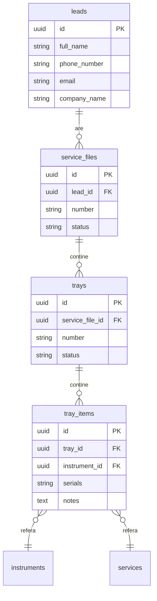

# Analiză Căutare Globală - CRM

## 1. Cerințe Utilizator

### Căutare Lead-uri după:
- ✅ Nume client
- ✅ Număr de telefon
- ✅ Email

### Căutare Fișe de Service după:
- ✅ Nume client (via lead asociat)
- ✅ Număr telefon (via lead asociat)
- ✅ Tăvițe (număr tăviță returnează lead-ul)
- ✅ Serial number instrumente din tăvițe (returnează lead-ul)

---

## 2. Arhitectura Actuală

### 2.1 Flow-ul Căutării

```mermaid
flowchart TD
    A[Utilizator introduce termen] --> B[/api/search/unified]
    B --> C{searchUnifiedWithClient}
    C --> D[Strategia 1: RPC search_unified]
    D --> E{RPC disponibil?}
    E -->|Da| F[Returnează rezultate]
    E -->|Nu| G[Strategia 2: Direct Queries]
    G --> H[searchViaDirectQueries]
    H --> I[Rezolvare pipeline info]
    I --> F
```

### 2.2 Fișiere Implicate

| Fișier | Rol |
|--------|-----|
| [`app/(crm)/search/page.tsx`](app/(crm)/search/page.tsx) | Pagina UI pentru căutare globală |
| [`app/api/search/unified/route.ts`](app/api/search/unified/route.ts) | API endpoint pentru căutare unificată |
| [`lib/supabase/unifiedSearchServer.ts`](lib/supabase/unifiedSearchServer.ts) | Logica de căutare pe server |
| [`lib/supabase/traySearchServer.ts`](lib/supabase/traySearchServer.ts) | Căutare specializată tăvițe |

### 2.3 Structura Bazei de Date



---

## 3. Implementarea Actuală - Detalii

### 3.1 Căutare Lead-uri [`unifiedSearchServer.ts:232-312`](lib/supabase/unifiedSearchServer.ts:232)

| Criteriu | Implementat | Metodă |
|----------|-------------|--------|
| | Nume client | ✅ | Token-based cu variante diacritice |
| Telefon | ✅ | Variante: 07xx, +407xx, 407xx |
| Email | ✅ | ILIKE pattern matching |
| Companie | ✅ | Variante diacritice |
| Tag-uri | ✅ | Via lead_tags join |

### 3.2 Căutare prin Fișe de Service și Tăvițe

| Criteriu | Implementat | Returnează | Exact Match |
|----------|-------------|------------|-------------|
| Număr fișă | ✅ | Lead cu pipeline Recepție | Parțial |
| Număr tăviță | ✅ | Lead cu pipeline Recepție | **Exact** |
| Serial number | ✅ | Lead cu pipeline Recepție | **Exact** |
| Tehnician | ✅ | Lead cu pipeline Recepție | Parțial |

### 3.3 Căutare Exactă pentru Tăvițe și Serial

#### Căutare după Număr Tăviță

Căutarea după numărul tăviței este **exactă** (case-sensitive). Aceasta înseamnă că:

- Căutarea "2S" returnează doar lead-uri cu tăvița "2S"
- Căutarea "2S" **NU** returnează lead-uri cu "12S", "02S", "3S", etc.

**Implementare:**

```typescript
// În lib/supabase/traySearchServer.ts
const numberVariants = getDiacriticVariants(termNorm).map((v) => `number.eq.${v}`)
const numberOr = numberVariants.length > 0 ? numberVariants.join(',') : `number.eq.${searchTerm}`
```

#### Căutare după Serial Number

Căutarea după serial number este **exactă** (case-sensitive):

- Căutarea "ABC123" returnează doar lead-uri cu serial "ABC123"
- Căutarea "ABC123" **NU** returnează lead-uri cu "abc123", "abc123", "ABC1234", etc.

**Implementare:**

```typescript
// În lib/supabase/traySearchServer.ts
const serialVariants = getDiacriticVariants(termNorm).map((v) => `serials.eq.${v}`)
const serialOr = serialVariants.length > 0 ? serialVariants.join(',') : `serials.eq.${searchTerm}`
```

---

## 4. Comportament Final Implementat

### 4.1 Principiu Fundamental

**TOATE rezultatele sunt de tip LEAD.**

Când utilizatorul caută după orice criteriu (nume, telefon, email, tăviță, serial, tehnician), sistemul returnează întotdeauna lead-ul asociat.

### 4.2 Navigare Corectă

| Cum a fost găsit | Pipeline de deschidere | Motiv |
|------------------|------------------------|-------|
| Nume, telefon, email, companie, tag | Pipeline-ul actual al lead-ului (ex: Vânzări) | Lead-uri de vânzări |
| Serial, număr tăviță, număr fișă, tehnician | **Recepție** | Lead-uri cu fișe de service |

### 4.3 Implementare Tehnică

#### Flag `preferServicePipeline`

În [`unifiedSearchServer.ts`](lib/supabase/unifiedSearchServer.ts), am adăugat flag-ul `preferServicePipeline` pentru lead-urile găsite prin:

- Serial number (`matchedBy: 'serial'`)
- Număr tăviță (`matchedBy: 'number'`)
- Număr fișă (`matchedBy: 'number'`)
- Tehnician (`matchedBy: 'technician'`)

Acest flag indică faptul că pipeline-ul preferat este **Recepție**, nu pipeline-ul din `pipeline_items`.

```typescript
// RawSearchRow type
type RawSearchRow = {
  type: UnifiedSearchItemType
  id: string
  title: string
  subtitle?: string
  openId: string
  fallbackSlug: string
  fallbackName: string
  leadId: string
  matchedBy?: MatchedByType
  serviceFileId?: string
  preferServicePipeline?: boolean // Flag pentru lead-uri găsite prin service-related searches
}
```

#### Logica de Mapping Final

```typescript
// Dacă preferServicePipeline=true, prioritizăm fallback (receptie) peste pipeline-ul din pipeline_items
const pipelineSlug = r.preferServicePipeline
  ? (leadFallback?.slug || r.fallbackSlug)
  : (pi?.slug || leadFallback?.slug || r.fallbackSlug)
```

---

## 5. UI - Afișare Rezultate

### 5.1 Badge-uri bazate pe `matchedBy`

| matchedBy | Badge | Culoare |
|-----------|-------|---------|
| phone | Telefon | Verde |
| name | Nume | Verde |
| email | Email | Verde |
| company | Companie | Verde |
| tag | Tag | Verde |
| **serial** | **Serial** | **Portocaliu** |
| **number** | **Număr** | **Portocaliu** |
| **technician** | **Tehnician** | **Portocaliu** |

Culori:
- **Verde**: Lead-uri găsite prin criterii de vânzări (nume, telefon, email)
- **Portocaliu**: Lead-uri găsite prin criterii de service (serial, tăviță, tehnician)

### 5.2 Exemple de Rezultate

```
┌─────────────────────────────────────────────────────────────┐
│ 👤 Popescu Ion                                     [Serial] │
│    0722 123 456 · Serial: ABC123 · Tăviță: 38M · Fișă: 15   │
│    Recepție                                                  │
└─────────────────────────────────────────────────────────────┘

┌─────────────────────────────────────────────────────────────┐
│ 👤 Ionescu Maria                                    [Nume]  │
│    Company SRL · ionescu@company.com                        │
│    Vânzări · Comandă                                        │
└─────────────────────────────────────────────────────────────┘
```

---

## 6. Flow de Navigare

### 6.1 La Click pe Rezultat

```typescript
// În app/(crm)/search/page.tsx
const handleSelect = useCallback(
  (result: UnifiedSearchResult) => {
    const payload = {
      pipelineSlug: result.pipelineSlug, // 'receptie' sau 'vanzari' etc.
      openType: 'lead' as const,
      openId: result.openId,
    }
    // Navigare către pipeline-ul corect
    router.push(`/leads/${payload.pipelineSlug}?openLeadId=${payload.openId}`)
  },
  [router]
)
```

### 6.2 Exemple de Navigare

| Căutare | Rezultat | Navigare |
|---------|----------|----------|
| "38M" (tăviță) | Lead Popescu Ion | `/leads/receptie?openLeadId=xxx` |
| "ABC123" (serial) | Lead Popescu Ion | `/leads/receptie?openLeadId=xxx` |
| "Popescu" (nume) | Lead Popescu Ion | `/leads/vanzari?openLeadId=xxx` |

---

## 7. Modificări Efectuate

### 7.1 [`lib/supabase/unifiedSearchServer.ts`](lib/supabase/unifiedSearchServer.ts)

1. Adăugat `preferServicePipeline` în `RawSearchRow` type
2. Secțiunea3 (tehnician): Returnează `lead` cu `preferServicePipeline: true`
3. Secțiunea4 (număr fișă): Returnează `lead` cu `preferServicePipeline: true`
4. Secțiunea5 (tăviță/serial): Returnează `lead` cu `preferServicePipeline: true`
5. Logica de mapping finală respectă `preferServicePipeline`

### 7.2 [`app/(crm)/search/page.tsx`](app/(crm)/search/page.tsx)

1. Simplificat `handleSelect` - toate rezultatele sunt lead-uri
2. Actualizat `ResultRow` să afișeze badge-uri bazate pe `matchedBy`
3. Culori diferite pentru lead-uri de service vs. lead-uri de vânzări
4. Eliminat secțiunile separate (lead-uri, fișe, tăvițe) - acum toate într-o singură listă

---

## 8. Beneficii

1. **Navigare corectă**: Lead-urile găsite prin serial/tăviță se deschid în Recepție, nu în Vânzări
2. **Fără redirectări**: Utilizatorul ajunge direct în pipeline-ul corect
3. **UI clar**: Badge-urile indică cum a fost găsit lead-ul
4. **Fără duplicate**: Fiecare lead apare o singură dată în rezultate
5. **Subtitle informativ**: Arată detalii despre tăviță/serial/fișă când e relevant

---

## 9. Testare

### Scenarii de Test

| Scenariu | Termen Căutare | Rezultat Așteptat | Exact Match |
|----------|----------------|-------------------|-------------|
| Nume client | "Popescu" | Lead cu badge "Nume", pipeline Vânzări | Parțial |
| Telefon | "0722 123 456" | Lead cu badge "Telefon", pipeline Vânzări | Parțial |
| Email | "ion@email.com" | Lead cu badge "Email", pipeline Vânzări | Parțial |
| Număr tăviță | "2S" | Lead cu badge "Număr", pipeline Recepție | **Exact** |
| Număr tăviță | "12S" | Lead cu badge "Număr", pipeline Recepție | **Exact** |
| Serial | "ABC123" | Lead cu badge "Serial", pipeline Recepție | **Exact** |
| Serial | "abc123" | Lead cu badge "Serial", pipeline Recepție | **Exact** |
| Număr fișă | "15" | Lead cu badge "Număr", pipeline Recepție | Parțial |
| Tehnician | "Ion" | Lead cu badge "Tehnician", pipeline Recepție | Parțial |

---

## 10. Note Tehnice

- Build-ul are erori pre-existente în proiect (legate de `pages/_document`) care nu sunt cauzate de modificările efectuate.
- Modificările la [`unifiedSearchServer.ts`](lib/supabase/unifiedSearchServer.ts) și [`app/(crm)/search/page.tsx`](app/(crm)/search/page.tsx) sunt corecte din punct de vedere sintactic.
