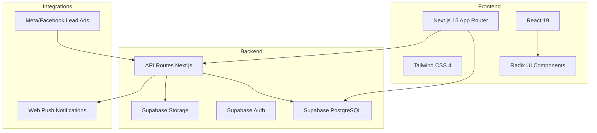
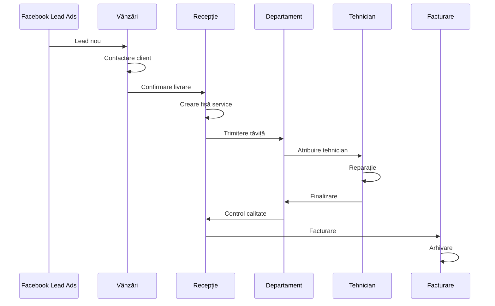
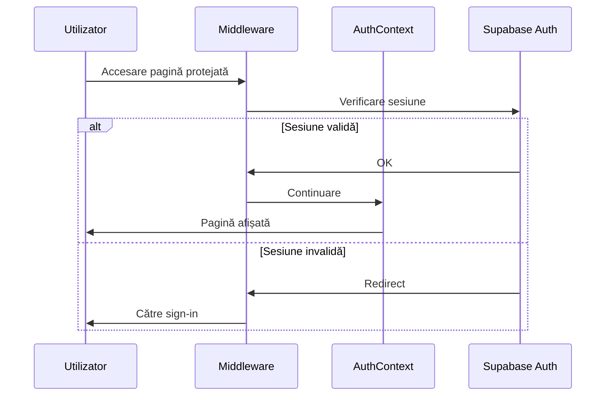

# Analiza Proiectului Ascutzit CRM

## 1. Rezumat Executiv

**Ascutzit CRM** este o platformă CRM internă pentru o afacere de service/reparații instrumente profesionale (salon, horeca, frizerie). Aplicația gestionează întregul ciclu de viață al clientului – de la **lead** la **livrare**, **recepție**, **reparație**, **control calitate** și **facturare**.

### Informații Proiect
| Câmp | Valoare |
|------|---------|
| **Nume** | ascutzit-crm |
| **Versiune** | 0.2.0 |
| **Framework** | Next.js 15.5.9 |
| **React** | 19.2.3 |
| **Stilizare** | Tailwind CSS 4 + Radix UI |
| **Backend** | Supabase (PostgreSQL + Auth + Storage) |
| **State Management** | TanStack Query v5 |

---

## 2. Arhitectura Tehnică

### 2.1 Stack Tehnologic



### 2.2 Structura Aplicației

```
app/
├── (crm)/                    # Rute protejate CRM
│   ├── admins/               # Gestionare membri
│   ├── configurari/          # Configurări catalog
│   ├── dashboard/            # Dashboard-uri și statistici
│   ├── leads/                # Pipeline-uri Kanban
│   ├── profile/              # Profil utilizator
│   ├── search/               # Căutare globală
│   └── tehnician/            # Dashboard tehnician
├── api/                      # API Routes (48+ endpoint-uri)
├── auth/                     # Autentificare
└── setup/                    # Setup inițial
```

---

## 3. Funcționalități Principale

### 3.1 Module de Business

| Modul | Descriere | Utilizatori |
|-------|-----------|-------------|
| **Vânzări** | Gestionare lead-uri, callback, nu răspunde, no deal, livrări | Vânzători |
| **Recepție** | Fișe de service, colet ajuns, colet neridicat, de facturat | Recepție |
| **Departamente** | Tăvițe în lucru pe specializări: Saloane, Horeca, Frizerii | Tehnicieni |
| **Control Calitate** | Validare tăvițe finalizate | Tehnicieni Senior |
| **Facturare** | Generare facturi, arhivare | Admin/Recepție |

### 3.2 Fluxul de Lucru



---

## 4. Structura Bazei de Date

### 4.1 Tabele Principale

| Tabel | Descriere |
|-------|-----------|
| `leads` | Lead-uri din Facebook / manual |
| `pipelines` | Pipeline-uri Kanban |
| `stages` | Etape în pipeline |
| `lead_pipelines` | Asociere lead-pipeline-stage |
| `stage_history` | Istoric mutări între etape |
| `service_files` | Fișe de service |
| `trays` | Tăvițe (containere instrumente) |
| `tray_items` | Elemente în tăviță |
| `app_members` | Membri echipă |
| `tags` | Etichete pentru lead-uri |

### 4.2 Entități Cheie

```typescript
// Lead - client potențial
interface Lead {
  id: string
  full_name: string | null
  email: string | null
  phone_number: string | null
  no_deal: boolean | null
  call_back: boolean | null
  callback_date: string | null
  nu_raspunde: boolean | null
  // ... câmpuri adresă, companie, billing
}

// Service File - fișă de service
interface ServiceFile {
  id: string
  lead_id: string
  number: string
  status: 'noua' | 'in_lucru' | 'finalizata' | 'comanda' | 'facturata'
  curier_trimis: boolean
  office_direct: boolean
  // ...
}

// Tray - tăviță cu instrumente
interface Tray {
  id: string
  service_file_id: string
  number: string
  department_id: string | null
  technician_id: string | null
  status: string
  // ...
}
```

---

## 5. API și Endpoint-uri

### 5.1 Categorii API

| Categorie | Endpoint-uri | Descriere |
|-----------|--------------|-----------|
| `/api/admin/` | 10 endpoint-uri | Administrare sistem |
| `/api/auth/` | 1 endpoint | Autentificare |
| `/api/cron/` | 5 endpoint-uri | Joburi programate |
| `/api/leads/` | 6 endpoint-uri | Gestionare lead-uri |
| `/api/vanzari/` | 4 endpoint-uri | Operațiuni vânzări |
| `/api/trays/` | 1 endpoint | Operațiuni tăvițe |
| `/api/service-files/` | 2 endpoint-uri | Fișe service |
| `/api/push/` | 5 endpoint-uri | Notificări push |

### 5.2 Joburi Automate (Cron)

| Job | Orar | Acțiune |
|-----|------|---------|
| `midnight-ro` | Zilnic 00:00 | Arhivare, curățare date |
| `backup` | Zilnic | Backup bază de date |
| `vanzari-followup-reminder` | La 2 ore | Reminder callback-uri |
| `vanzari-archive-no-deal` | Zilnic | Arhivare lead-uri vechi |
| `curier-to-avem-comanda` | Zilnic | Actualizare status curier |

---

## 6. Componente UI Principale

### 6.1 Structura Componentelor

```
components/
├── ui/                    # Componente Radix UI shadcn
├── kanban/                # Board Kanban și card-uri
│   ├── kanban-board.tsx   # Board principal (103K chars)
│   └── lead-card.tsx      # Card lead (149K chars)
├── leads/                 # Detalii și panouri lead
│   ├── lead-details-panel.tsx
│   ├── lead-messenger.tsx
│   └── VanzariPanel.tsx
├── preturi/               # Sistem prețuri și tăvițe
│   ├── core/              # Orchestrator principal
│   ├── views/             # Vizualizări (Recepție, Vânzări)
│   └── dialogs/           # Dialoguri acțiuni
├── layout/                # Sidebar, theme
├── admin/                 # Componente administrare
└── mobile/                # Variante mobile
```

### 6.2 Componente Critice (dimensiune)

| Componentă | Dimensiune | Responsabilitate |
|------------|------------|------------------|
| `lead-card.tsx` | 149K chars | Card lead în Kanban |
| `kanban-board.tsx` | 103K chars | Board Kanban principal |
| `tehnician/tray/[trayId]/page.tsx` | 104K chars | Pagină tehnician |
| `mobile/lead-details-sheet.tsx` | 157K chars | Detalii lead mobile |
| `VanzariViewV4.tsx` | 107K chars | Vizualizare vânzări |

---

## 7. Integrări Externe

### 7.1 Meta/Facebook Lead Ads

- Webhook pentru primire lead-uri automate
- Simulare lead-uri pentru testare
- Câmpuri capturate: nume, email, telefon, oraș, adresă

### 7.2 Web Push Notifications

- Abonare notificări
- Notificări pentru callback-uri
- Notificări pentru tăvițe noi

### 7.3 Supabase

- **Auth**: Autentificare cu email/parolă
- **Database**: PostgreSQL cu RLS
- **Storage**: Imagini tăvițe
- **Realtime**: Actualizări în timp real (opțional)

---

## 8. Securitate

### 8.1 Măsuri Implementate

- **Middleware**: Verificare sesiune pe rute protejate
- **RLS**: Row Level Security în Supabase
- **Auth Context**: Gestionare stare autentificare
- **Permissions**: Sistem permisiuni pe pipeline-uri

### 8.2 Flux Autentificare



---

## 9. Observații și Recomandări

### 9.1 Puncte Forte

✅ **Arhitectură modernă**: Next.js 15 + React 19 + Supabase
✅ **UI consistent**: Radix UI + Tailwind CSS
✅ **Funcționalitate completă**: Acoperă tot ciclul de business
✅ **Suport mobile**: Componente responsive
✅ **Documentație existentă**: Analize detaliate în `/docs`

### 9.2 Zone de Îmbunătățire

⚠️ **Componente foarte mari**: `lead-card.tsx` (149K), `kanban-board.tsx` (103K)
⚠️ **Datorie tehnică**: 1300+ `as any`, cod duplicat
⚠️ **Fără teste**: 0% acoperire teste
⚠️ **Logging insuficient**: Doar console.*, fără serviciu centralizat
⚠️ **Performanță**: Riscuri N+1 queries, componente grele

### 9.3 Recomandări Prioritare

1. **Refactorizare componente mari** - Împărțire în componente mai mici
2. **Adăugare teste** - Unit tests cu Vitest, E2E cu Playwright
3. **Optimizare performanță** - React.memo, virtualizare liste
4. **Monitoring** - Integrare Sentry sau similar
5. **Type safety** - Eliminare `as any`, adăugare tipuri stricte

---

## 10. Concluzie

Ascutzit CRM este o aplicație complexă și funcțională pentru gestionarea unui business de service/reparații. Arhitectura bazată pe Next.js și Supabase oferă o fundație solidă, dar există oportunități semnificative de îmbunătățire a calității codului, performanței și testării.

Proiectul are nevoie de:
- **Refactorizare** pentru a reduce complexitatea componentelor
- **Testare** pentru a asigura stabilitatea
- **Monitoring** pentru a detecta probleme în producție
- **Optimizare** pentru a îmbunătăți performanța

---

*Analiză generată la data de 2026-03-09*
